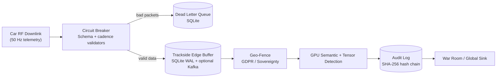

# Cadillac F1 Telemetry Platform

[](.)


**GPU-Accelerated Real-Time Telemetry Processing for 2026 F1 Season (Ubuntu 24.04 + AMD ROCm)**

**Compatibility:**
- Primary target: Ubuntu 24.04 LTS + AMD ROCm (validated)
- Optional fallback: NVIDIA CUDA (commands kept commented in Quick Start)

## Executive Summary

A production-ready telemetry spine that processes race-weekend scale loads with sub-millisecond p95 latency on AMD Radeon RX 7900 XT, while preserving forensic traceability and local-first resilience.

**What this platform does well:**
- Sustains high-throughput telemetry processing under injected chaos
- Detects/reconciles corruption with GPU semantic + tensor pipelines
- Preserves continuity with local-first buffering and optional Kafka streaming
- Enforces tamper-evident provenance (SHA-256 hash chain)
- Tracks race-readiness via deterministic SLO gates

## Table of Contents

- [Quick Start (Ubuntu 24.04 + AMD ROCm)](#quick-start-ubuntu-2404--amd-rocm)
- [Run Profiles](#run-profiles)
  - [1) Baseline GPU Benchmarks](#1-baseline-gpu-benchmarks)
  - [2) Kafka DLQ Routing Validation](#2-kafka-dlq-routing-validation)
  - [3) Diagnostic Mode (Missed-Detection Attribution)](#3-diagnostic-mode-missed-detection-attribution)
  - [4) Repair-Focused Validation](#4-repair-focused-validation)
- [Validated Results](#validated-results)
- [System Architecture](#system-architecture)
- [Operational Capabilities](#operational-capabilities)
- [Docker Deployment](#docker-deployment)
- [Testing & Validation](#testing--validation)
- [Architecture Decision Records](#architecture-decision-records)
- [About](#about)
- [Licensing](#licensing)

---

## Quick Start (Ubuntu 24.04 + AMD ROCm)

```bash
# 0. Prerequisites
sudo apt update && sudo apt install -y python3-venv

# 1. Environment
python3 -m venv .venv
source .venv/bin/activate

# 2. Dependencies
python3 -m pip install --upgrade pip
python3 -m pip install -r requirements.txt

# Force ROCm wheels on AMD
python3 -m pip uninstall -y torch torchvision torchaudio
python3 -m pip install torch torchvision torchaudio --index-url https://download.pytorch.org/whl/rocm6.2.4

# NVIDIA fallback (keep commented unless on NVIDIA)
# python3 -m pip uninstall -y torch torchvision torchaudio
# python3 -m pip install torch torchvision torchaudio --index-url https://download.pytorch.org/whl/cu128

# 3. Build accelerated ingest
python3 setup.py build_ext --inplace

# 4. Verify GPU path
PYTHONPATH="." python3 -c "from archive.modules.translator import TelemetryIngestor; print('fast_ingest available:', TelemetryIngestor.is_accelerated())"
python3 -c "import torch; print('CUDA/ROCm available:', torch.cuda.is_available()); print('Device:', torch.cuda.get_device_name(0) if torch.cuda.is_available() else 'CPU')"
```

If SQLite lock artifacts exist from prior runs:

```bash
pkill -f cadillac_gpu_stress_test.py
find . -name "*.db" -type f -delete
find . -name "*.db-wal" -type f -delete
find . -name "*.db-shm" -type f -delete
```

---

## Run Profiles

### 1) Baseline GPU Benchmarks

```bash
# Sprint benchmark (30,000 total packets)
source .venv/bin/activate && FORCE_DEVICE=gpu PYTHONPATH="." python3 tools/cadillac_gpu_stress_test.py --packets 2000 --chaos 0.05 --output-suffix _sprint | tee data/reports/run_sprint.log

# Race weekend benchmark (3.6M total packets)
source .venv/bin/activate && FORCE_DEVICE=gpu PYTHONPATH="." python3 tools/cadillac_gpu_stress_test.py --packets 240000 --chaos 0.05 --output-suffix _weekend | tee data/reports/run_weekend.log
```

### 2) Kafka DLQ Routing Validation

```bash
# Sprint + Kafka
source .venv/bin/activate && FORCE_DEVICE=gpu PYTHONPATH="." python3 tools/cadillac_gpu_stress_test.py --packets 2000 --chaos 0.05 --enable-kafka --kafka-servers localhost:9092 --kafka-topic-repairable dlq-repairable-sprint-005 --kafka-topic-repaired dlq-repaired-sprint-005 --kafka-topic-non-repairable dlq-non-repairable-sprint-005 --output-suffix _sprint_kafka | tee data/reports/run_sprint_kafka.log

# Weekend + Kafka
source .venv/bin/activate && FORCE_DEVICE=gpu PYTHONPATH="." python3 tools/cadillac_gpu_stress_test.py --packets 240000 --chaos 0.05 --enable-kafka --kafka-servers localhost:9092 --kafka-topic-repairable dlq-repairable-weekend-005 --kafka-topic-repaired dlq-repaired-weekend-005 --kafka-topic-non-repairable dlq-non-repairable-weekend-005 --output-suffix _weekend_kafka | tee data/reports/run_weekend_kafka.log
```

### 3) Diagnostic Mode (Missed-Detection Attribution)

```bash
# Diagnostic run (balanced profile)
source .venv/bin/activate && FORCE_DEVICE=gpu PYTHONPATH="." python3 tools/cadillac_gpu_stress_test.py --packets 60000 --chaos 0.12 --chaos-profile balanced --diagnostic --output-suffix _diagnostic_weekend

# Analyze diagnostic JSON in terminal
source .venv/bin/activate && python3 tools/sensor_fault_diagnostic.py --input data/reports/missed_detection_analysis_diagnostic_weekend.json
```

Diagnostic artifacts:
- `missed_detection_analysis_<suffix>.json`
- `missed_detection_analysis_<suffix>.csv`

Supported chaos profiles: `balanced`, `repair_focus`.

#### Diagnostic Deep-Dive (Attribution)

From `missed_detection_analysis_diagnostic_weekend.csv`:

- By sensor:
  - `ecu_canbus`: `299 / 10,586` missed (`2.82%`)
  - `g_force_lateral`: `69 / 10,864` missed (`0.64%`)
  - `throttle`: `2 / 10,718` missed (`0.02%`)
- By chaos mode:
  - `bit_flip_low`: `335 / 15,509` missed (`2.16%`)
  - `bit_flip_high`: `35 / 15,423` missed (`0.23%`)
- Highest-risk combinations:
  - `ecu_canbus + bit_flip_low`: `274 / 1,519` (`18.04%`)
  - `g_force_lateral + bit_flip_low`: `61 / 1,583` (`3.85%`)

Interpretation: the remaining gap is concentrated in low-bit-flip behavior on a narrow sensor subset, not uniformly distributed across sessions.

### 4) Repair-Focused Validation

This profile stresses repairability/runtime with:
- `schema_drift`
- `duplicate_timestamp`
- `string_in_numeric`

```bash
# Sprint @ chaos 0.005
source .venv/bin/activate && FORCE_DEVICE=gpu PYTHONPATH="." python3 tools/cadillac_gpu_stress_test.py --packets 2000 --chaos 0.005 --chaos-profile repair_focus --enable-kafka --kafka-servers localhost:9092 --kafka-topic-repairable dlq-repairable-sprint-rf005 --kafka-topic-repaired dlq-repaired-sprint-rf005 --kafka-topic-non-repairable dlq-non-repairable-sprint-rf005 --output-suffix _sprint_repairfocusrealistic_kafka | tee data/reports/run_sprint_repairfocusrealistic_kafka.log

# Weekend @ chaos 0.005
source .venv/bin/activate && FORCE_DEVICE=gpu PYTHONPATH="." python3 tools/cadillac_gpu_stress_test.py --packets 240000 --chaos 0.005 --chaos-profile repair_focus --enable-kafka --kafka-servers localhost:9092 --kafka-topic-repairable dlq-repairable-weekend-rf005 --kafka-topic-repaired dlq-repaired-weekend-rf005 --kafka-topic-non-repairable dlq-non-repairable-weekend-rf005 --output-suffix _weekend_repairfocusrealistic_kafka | tee data/reports/run_weekend_repairfocusrealistic_kafka.log
```

---

## Validated Results

### Weekend KPI Snapshot (3.6M packets @ 5% chaos)

| Metric | Result |
|---|---:|
| Total Packets | 3,600,000 |
| Acceptance Rate | 95.76% |
| Chaos Injected | 179,617 |
| Schema-Drift Recovered (GPU) | 25,790 |
| Tensor Anomalies Detected | 145,297 |
| p95 Latency | 0.004 ms |
| Breaker Trips | 0 |
| DLQ Quarantined | 152,533 |
| DLQ Repairs Recovered | 68 |
| Detection Rate | 99.77% |
| SLOs Passed | 6/6 |
| Verdict | RACE-READY ✅ |

### Kafka Topic Totals (Weekend @ 5% chaos)

| Topic | Messages |
|---|---:|
| `dlq-repairable-weekend-005` | 152,733 |
| `dlq-repaired-weekend-005` | 68 |
| `dlq-non-repairable-weekend-005` | 0 |

---

## System Architecture

### High-Level Overview

```
┌─────────────────────────────────────────────────────────────────┐
│                      GPU STRESS TEST SCRIPT                     │
│              tools/cadillac_gpu_stress_test.py                  │
│  • BERT Semantic Reconciliation (GPU-accelerated)               │
│  • Tensor Anomaly Detection (z-score > 3σ)                      │
│  • Batch Hash-Chain Provenance (SHA-256)                        │
│  • Synthetic telemetry generation & chaos injection              │
└────────────────────────┬────────────────────────────────────────┘
                         │
                         ├──► src/circuit_breaker.py
                         │    • Three-state FSM (CLOSED → OPEN → HALF_OPEN)
                         │    • Schema validation, cadence checks, DLQ routing
                         │
                         ├──► src/local_persistence.py
                         │    • Local-first edge buffer (SQLite WAL + optional Kafka)
                         │
                         ├──► src/geo_fence.py
                         │    • Jurisdiction-aware handling (GDPR/sovereignty)
                         │
                         ├──► src/audit_log.py
                         │    • Tamper-evident SHA-256 hash chains
                         │
                         └──► src/slo.py
                              • SLO tracking + race-ready verdict gates
```

### Data Flow



### Core Components

| Component | Purpose | Status |
|---|---|---|
| `tools/cadillac_gpu_stress_test.py` | GPU benchmark orchestrator + diagnostics | ✅ Active |
| `src/circuit_breaker.py` | Validation, cadence checks, DLQ | ✅ Active |
| `src/local_persistence.py` | Edge buffering and optional stream fan-out | ✅ Active |
| `src/geo_fence.py` | Data sovereignty controls | ✅ Active |
| `src/audit_log.py` | Tamper-evident provenance | ✅ Active |
| `src/middleware/tracing.py` | Context propagation | ✅ Active |
| `src/slo.py` | SLO evaluation and reporting | ✅ Active |

---

## Operational Capabilities

| Capability | Module | Evidence |
|---|---|---|
| Local-first reliability during connectivity drops | `src/local_persistence.py` | SQLite WAL edge buffer + replay |
| Corruption isolation before downstream consumers | `src/circuit_breaker.py` | Deterministic DLQ quarantine |
| Runtime schema reconciliation | GPU semantic path | Schema-drift recovery at scale |
| Tamper-evident lineage | `src/audit_log.py` | Linked SHA-256 chain verification |
| Compliance handling by jurisdiction | `src/geo_fence.py` | EU GDPR-aware pathing/scrubbing |

---

## Docker Deployment

Production-hardened configuration is provided in `Dockerfile.production` and `docker-compose.production.yml`.

```bash
docker-compose -f docker-compose.production.yml up -d
```

---

## Testing & Validation

```bash
# Full test suite
PYTHONPATH="." pytest tests/ -v

# CPU stress test
PYTHONPATH="." python tools/cadillac_stress_test.py --packets 5000 --chaos 0.20

# Engine temperature anomaly test
PYTHONPATH="." python tools/stress_test_engine_temp.py
```

---

## Architecture Decision Records

Key decisions documented in [`docs/adr/`](docs/adr/):

| ADR | Decision | Rationale |
|---|---|---|
| [001](docs/adr/001-sqlite-wal-over-redis.md) | SQLite WAL over Redis | Zero-dependency, crash-safe trackside operation |
| [002](docs/adr/002-circuit-breaker-over-retry-loop.md) | Circuit breaker over retry loop | Stable latency under corruption |
| [003](docs/adr/003-hash-chain-audit-over-append-only-log.md) | Hash-chain audit | Cryptographic tamper evidence |

---

## About

**Developer:** Tarek Clarke  
**Background:** Senior Data Analyst, Statistics Canada (10+ years) | Incoming PhD Candidate, TalTech

This repository is a production-ready implementation of PhD research at TalTech on Reproducible Analytical Pipelines (RAP) for high-velocity telemetry.

---

## Licensing

**PolyForm Noncommercial License 1.0.0**  
Commercial use requires separate agreement.

**Contact:** tclarke91@proton.me
