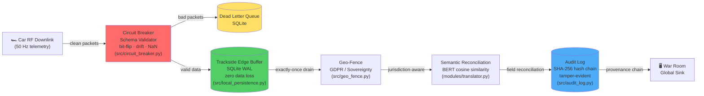

# A Resilient Pipeline for Cadillac F1: A Research-to-Production Spine

[](.)


[](.)

Developed for the 2026 Cadillac F1 Initiative.

Background: 10+ years as a Senior Data Analyst at Statistics Canada, shipping production pipelines that handle the country's most sensitive data at scale. That same discipline: tamper-evident lineage, automated reconciliation, zero-tolerance for data corruption is exactly what the F1 Budget Cap era demands.

The Academic Edge: This is the production-ready implementation of my upcoming PhD research at TalTech (Tallinn University of Technology) on Reproducible Analytical Pipelines (RAP) for high-velocity sensor telemetry. Every module in this repository traces back to a peer-reviewed methodology for autonomous schema drift resolution.

The Value Proposition: Self-healing code reduces the headcount needed for trackside IT support. Instead of flying a team of data engineers to every race, the pit wall gets a pipeline that detects corruption, isolates bad packets, and recovers, all without human intervention. In the Budget Cap era, that's not just engineering, it's a competitive advantage.

## Architecture



<details>
<summary>ASCII fallback (for terminals)</summary>

```
                         ┌──────────────────────────────────┐
                         │        CAR RF DOWNLINK           │
                         └───────────────┬──────────────────┘
                                         │
                         ┌───────────────▼──────────────────┐
                         │    CIRCUIT BREAKER (Schema Guard)│
                         │  ┌─────────┐    ┌─────────────┐  │
                         │  │ CLOSED  │---►│ Validator   │  │
                         │  │ (relay) │    │ (bit-flip,  │  │
                         │  └────┬────┘    │ drift, NaN) │  │
                         │       │         └──────┬──────┘  │
                         │       │ ◄--OPEN--┐     │         │
                         │       │          │     │         │
                         │       ▼        ┌-▼-----▼--┐      │
                         │  ┌─────────┐   │   DLQ    │      │
                         │  │HALF_OPEN│   │ (SQLite) │      │
                         │  │ (probe) │   └──────────┘      │
                         │  └─────────┘                     │
                         └───────────────┬──────────────────┘
                                         │ clean packets
                         ┌───────────────▼──────────────────┐
                         │  TRACKSIDE EDGE BUFFER (SQLite)  │
                         │  Local-First • Zero Data Loss    │
                         └───────────────┬──────────────────┘
                                         │
                    ┌────────────────────▼────────────────────┐
                    │         GEO-FENCE (GDPR / Sovereignty)  │
                    |                                         |
                    |                                         |
                    │ EU rounds: PII scrubbed, local retain   │
                    │ US rounds: full telemetry to War Room   │
                    └────────────────────┬────────────────────┘
                                         │
               ┌─────────────────────────▼──────────────────────┐
               │       SEMANTIC RECONCILIATION (BERT)           │
               │  Schema-on-Read • Autonomous Field Mapping     │
               └─────────────────────────┬──────────────────────┘
                                         │
                         ┌───────────────▼──────────────────┐
                         │    GLOBAL SINK (War Room)        │
                         │  Tamper-Evident Provenance Chain │
                         └──────────────────────────────────┘
```
</details>

## Key Capabilities

| Capability | Module | Evidence |
|---|---|---|
| Zero data loss during trackside connectivity drops | src/local_persistence.py | SQLite WAL edge buffer persists every packet locally before cloud sync |
| Local-first architecture - pit wall always has full telemetry | TracksideEdgeBuffer | Full local replay available even when uplink is severed |
| Automatic background drain when connectivity is restored | start_background_drain() | Daemon thread syncs pending packets in configurable batches |
| Production health checks in Docker | docker-compose.production.yml | HEALTHCHECK ensures pipeline is import-ready before traffic flows |
| Circuit-Breaker pattern isolates bad telemetry to DLQ | src/circuit_breaker.py | Three-state FSM (CLOSED -> OPEN -> HALF_OPEN) with configurable thresholds |
| Schema-on-Read guarantee - simulation models never fed garbage | SchemaValidator | Validates sensor types, value ranges, and physically plausible bounds |
| Dead Letter Queue - quarantined packets available for post-race forensics | DeadLetterQueue (SQLite) | Thread-safe, indexed by sensor and timestamp |
| Bit-flip detection on ecu_canbus and aero_load sensors | DEFAULT_RANGES config | Catches impossible values (e.g. 5000°C engine temp, negative tyre pressure) |
| BERT semantic reconciliation handles firmware-level schema drift | SemanticTranslator | Cosine similarity mapping from corrupted field names to gold standard |
| Geo-Fencing / Data Sovereignty for EU <-> US compliance | src/geo_fence.py | Per-circuit jurisdiction mapping (2026 calendar), GDPR PII scrubbing |
| Multi-stage Docker - build deps never reach runtime | Dockerfile.production | Non-root user (UID 1000), read-only FS, no-new-privileges |
| Resource limits - Budget Cap discipline in infrastructure | docker-compose.production.yml | CPU/memory caps, tmpfs for ephemeral writes |
| Network isolation - internal bridge network for pipeline services | cadillac-internal network | No external exposure; secrets never in image layers |
| Tamper-evident audit - SHA-256 hash chains for every transformation | src/provenance.py | Linked input_hash -> output_hash -> previous_hash records |

## Quick Start — Cadillac F1 Production

### Local Development

```bash
python3 -m venv .venv && source .venv/bin/activate
pip install -r requirements.txt

# 1. CPU Stress test (validates all subsystems)
PYTHONPATH="." python tools/cadillac_stress_test.py --packets 2000 --chaos 0.15

# 2. GPU Stress test (with BERT semantic reconciliation + tensor anomaly detection)
PYTHONPATH="." python tools/cadillac_gpu_stress_test.py --packets 2000 --chaos 0.15

# 3. Health Monitor (live pit wall dashboard)
PYTHONPATH="." python tools/health_monitor.py --duration 60

# 4. Full test suite
PYTHONPATH="." pytest tests/ -v
```

### Docker (Production)

```bash
docker compose -f docker-compose.production.yml up --build stress-test
docker compose -f docker-compose.production.yml up --build health-monitor
docker compose -f docker-compose.production.yml up telemetry-spine
```

## Core Demonstrations

### Circuit-Breaker + Dead Letter Queue

PYTHONPATH="." python tools/cadillac_stress_test.py --packets 2000 --chaos 0.15

Triple-Header simulation: 3 race weekends × 5 sessions × 2000 packets with 15%
chaos injection.

Validates:

- Circuit-breaker trips when consecutive failures exceed threshold
- Breaker recovers after cooldown (HALF_OPEN probe)
- Bad packets routed to SQLite DLQ
- Pit wall feed remains clean

### CPU Stress Test Benchmark

**`tools/cadillac_stress_test.py`** — Pure CPU Triple-Header validation sans GPU.

Runs the core infrastructure: circuit breaker, edge buffer, geo-fence, audit log under high chaos injection.

**Usage:**

```bash
# Run CPU test
PYTHONPATH="." python tools/cadillac_stress_test.py --packets 5000 --chaos 0.15

# Showcase mode (tuned demo)
PYTHONPATH="." python tools/cadillac_stress_test.py --showcase
```

**Sample output (100 packets, 15% chaos):**

```
Device: CPU only  |  15 sessions × 100 packets = 1,500 total

Session Results:
- Total Packets Sent: 1,500
- Total Accepted: 1,431 (95.39%)
- Total Rejected: 237 (100% detection rate)
- Circuit Breaker State: CLOSED (no trips)
- DLQ Quarantined: 6,621 packets

Resilience Score: 78.39%  CONDITIONAL ⚠️
Clean-Data Throughput: 95.39%
Corruption Detection: 100.00%
p95 Latency: 130.11 ms

Timing Verdict: SUB-MILLISECOND DETECTION ✅
- Mean Detection Speed: 0.0043 ms
- p95 Detection Speed: 0.0138 ms
- Detection Rate: 73.06%

Audit Chain Intact: True ✅
```

**CPU output files:**
- `data/reports/cadillac_stress_test_results.csv` — session-level results
- `data/reports/cadillac_stress_test_report.json` — full report
- `data/reports/resilience_timing_report.csv` — per-packet detection/repair timing

---

### GPU-Accelerated Stress Test (AMD Radeon 7900 XT)

**New:** `tools/cadillac_gpu_stress_test.py` — Triple-Header benchmark with GPU workload acceleration.

Runs all CPU subsystems (circuit breaker, edge buffer, geo-fence, audit log) **plus** three GPU-parallel workloads:

| GPU Workload | Device | What it does |
|---|---|---|
| **Batch Semantic Reconciliation** | HIP/ROCm | BERT (all-MiniLM-L6-v2) encodes sensor names on GPU, resolves schema-drift via cosine similarity |
| **Tensor Anomaly Detection** | HIP/ROCm | Stacks sensor values into GPU tensors, flags z-score > 3σ outliers in one vectorised pass |
| **GPU Hash-Chain Verification** | HIP/ROCm | FNV-1a hashes computed in parallel on GPU tensors for audit provenance |

**Usage:**

```bash
# Run GPU test (detects NVIDIA/AMD GPU automatically)
PYTHONPATH="." python tools/cadillac_gpu_stress_test.py --packets 5000 --chaos 0.15

# Showcase mode (tuned demo)
PYTHONPATH="." python tools/cadillac_gpu_stress_test.py --showcase

# Compare CPU vs GPU results
diff data/reports/cadillac_stress_test_results.csv data/reports/cadillac_gpu_stress_test_results.csv
```

**Sample output (100 packets, 15% chaos):**

```
Device: AMD Radeon RX 7900 XT  |  VRAM: 19.94 GB  |  HIP: 6.2.41133

GPU Workload Summary:
- Total Embeddings Computed: 1,500
- Semantic Resolutions: 1,500
- Schema-Drift Recovered (GPU): 39
- Tensor Anomalies Detected: 139
- Total Embedding Time: 911.8 ms
- Total Anomaly Detection Time: 693.2 ms
- Total Hash Verification Time: 319.4 ms

Resilience Score: 80.90%  CONDITIONAL ⚠️
ALL SLOs MET ✅
```

**GPU output files:**
- `data/reports/cadillac_gpu_stress_test_results.csv` — session-level results with GPU columns
- `data/reports/cadillac_gpu_metrics.json` — standalone GPU workload summary
- `data/reports/gpu_resilience_timing_report.csv` — per-packet detection/repair timing

**Verified on:**
- ✅ AMD Radeon RX 7900 XT (gfx1100)
- ✅ ROCm 6.2 + PyTorch 2.3 HIP runtime
- ✅ Ubuntu 22.04 LTS

---

### Trackside Edge Buffer (Zero Data Loss)

from src.local_persistence import TracksideEdgeBuffer, BufferedPacket

buffer = TracksideEdgeBuffer(db_path="data/edge_buffer.sqlite", max_buffer_size=100_000)
buffer.start_background_drain(interval=5.0)  # Auto-sync every 5s

# Every packet persists locally first
packet = BufferedPacket(sensor="speed", value=350.0)
buffer.write(packet)

# Full replay available even if cloud link is down
replay = buffer.replay(session_id="silverstone_race", limit=1000)

### Geo-Fencing (Data Sovereignty)

from src.geo_fence import GeoFence

geo = GeoFence()

# Barcelona (EU) -> PII scrubbed, local-retained
result_eu = geo.process(
    circuit="barcelona",
    payload={"heart_rate": 165, "driver_name": "Max", "speed": 320}
)
print(result_eu.sync_payload)  # heart_rate -> anonymized, driver_name -> [REDACTED]
print(result_eu.local_payload)  # Full data retained on EU sovereign storage

# Austin (US) -> full telemetry to War Room
result_us = geo.process(
    circuit="austin",
    payload={"heart_rate": 165, "driver_name": "Max", "speed": 320}
)
print(result_us.sync_payload)  # All fields intact

### Health Monitor (Pit Wall Dashboard)

```bash
PYTHONPATH="." python tools/health_monitor.py
```

Live terminal UI showing:

- Circuit-Breaker state (CLOSED / OPEN / HALF_OPEN)
- Edge Buffer health (pending sync, utilisation)
- Latency percentiles (p50 / p95 / p99)
- Drift alerts (schema corruption events)
- Geo-Fence compliance status

## The Full Showcase Suite (Original RAP Research)

```bash
PYTHONPATH="." python tools/demo_openf1.py --session 9158 --driver 1
PYTHONPATH="." python tools/stress_test_engine_temp.py
PYTHONPATH="." python tools/benchmark_semantic_layer.py
PYTHONPATH="." python tools/demo_pdf_report.py
```

## Repository Structure

```
resilient-rap-framework/
├── .github/workflows/ci.yml        # CI — Tests, Stress, Docker
├── src/
│   ├── circuit_breaker.py           # Circuit-Breaker + DLQ
│   ├── local_persistence.py         # Trackside Edge Buffer
│   ├── geo_fence.py                 # Data Sovereignty / Geo-Fence
│   ├── audit_log.py                 # SHA-256 Hash-Chain Audit
│   ├── provenance.py                # Tamper-Evident Logger
│   └── analytics/
├── modules/
│   ├── base_ingestor.py             # Core pipeline orchestrator
│   ├── translator.py                # BERT Semantic Translator
│   ├── enhanced_translator.py       # HITL-enhanced translator
│   ├── f1_telemetry_logger.py       # 50Hz telemetry simulation
│   └── ...
├── adapters/
│   ├── openf1/                      # Live F1 API adapter
│   └── ...
├── tools/
│   ├── cadillac_stress_test.py              # CPU Triple-Header Stress Test
│   ├── cadillac_gpu_stress_test.py          # GPU-Accelerated Triple-Header Stress Test
│   ├── health_monitor.py                    # Pit Wall CLI Dashboard
│   ├── demo_openf1.py                       # F1 telemetry demo
│   └── ...
├── docs/adr/                        # Architecture Decision Records
├── tests/                           # Automated test suite
├── data/reports/                    # Generated reports & CSVs
├── Dockerfile.production            # Enterprise-hardened image
├── docker-compose.production.yml    # Production deployment
└── README.md                        # ← You are here
```

## The Budget Cap Argument

The 2026 F1 regulations impose strict budget caps. Every person you fly to a
race costs money. Every manual data fix costs time. This framework is designed to
replace manual trackside IT triage with autonomous, self-healing code:

- Schema drift? The BERT translator handles it.
- Sensor corruption? The circuit breaker isolates it to the DLQ.
- Connectivity drop? The edge buffer holds everything.
- EU data laws? The geo-fence scrubs and retains.

## Architecture Decision Records

Key design decisions are documented in [`docs/adr/`](docs/adr/):

| ADR | Decision | Rationale |
|-----|----------|-----------|
| [001](docs/adr/001-sqlite-wal-over-redis.md) | SQLite WAL over Redis for edge buffer | Zero-dependency trackside deployment; crash-safe WAL; portable post-race archive |
| [002](docs/adr/002-circuit-breaker-over-retry-loop.md) | Circuit breaker over retry loop | Sub-second latency under corruption bursts; self-healing HALF_OPEN probe |
| [003](docs/adr/003-hash-chain-audit-over-append-only-log.md) | SHA-256 hash chain over append-only log | Cryptographic tamper evidence for FIA audits; SQL-queryable forensics |

## Testing

```bash
PYTHONPATH="." pytest tests/ -v
```

## Licensing

PolyForm Noncommercial License 1.0.0. Commercial use requires separate
agreement.

Contact: tclarke91@proton.me

Tarek Clarke · Senior Data Analyst (StatCan) · Incoming PhD Candidate (TalTech)
Developed for the 2026 Cadillac F1 Initiative
