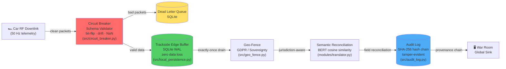

# A Resilient Pipeline for Cadillac F1: A Research-to-Production Spine

[](.)


Developed for the 2026 Cadillac F1 Initiative.

## Cadillac Engineering Snapshot

- Production-grade telemetry spine built for budget-cap constraints and zero downtime.
- Self-healing ingestion: schema drift, bit-flips, and NaN bursts isolated without human intervention.
- Trackside-first architecture: local replay and jurisdiction-aware geo-fencing.
- Audit-ready provenance: tamper-evident hash chains on every transformation.

## Linux ROCm Quickstart

```bash
# 0. One-time prerequisite
sudo apt update && sudo apt install -y python3-venv

# 1. Environment
python3 -m venv .venv
source .venv/bin/activate

# 2. Dependencies
python3 -m pip install --upgrade pip
python3 -m pip install -r requirements.txt
python3 -m pip install torch torchvision torchaudio --index-url https://download.pytorch.org/whl/rocm5.7

# 3. Build accelerated ingest
python3 setup.py build_ext --inplace

# 4. Verify Linux GPU path
PYTHONPATH="." python3 -c "from modules.translator import TelemetryIngestor; print('fast_ingest available:', TelemetryIngestor.is_accelerated())"
python3 -c "import torch; print('CUDA/ROCm available:', torch.cuda.is_available()); print('Device:', torch.cuda.get_device_name(0) if torch.cuda.is_available() else 'CPU')"
```

## Run Benchmarks

```bash
# Sprint benchmark (30,000 total packets)
source .venv/bin/activate && FORCE_DEVICE=gpu PYTHONPATH="." python3 tools/cadillac_gpu_stress_test.py --packets 2000 --chaos 0.05 --output-suffix _sprint | tee data/reports/run_sprint.log

# Race weekend benchmark (3.6M total packets)
source .venv/bin/activate && FORCE_DEVICE=gpu PYTHONPATH="." python3 tools/cadillac_gpu_stress_test.py --packets 240000 --chaos 0.05 --output-suffix _weekend | tee data/reports/run_weekend.log
```

## Linux GPU Benchmark Results

Validated on Linux with AMD Radeon RX 7900 XT (ROCm backend).

### Sprint Results (30,000 Packets @ 5% Chaos)

| Metric | Result | Status |
|--------|--------|--------|
| **GPU Device** | Radeon RX 7900 XT | ✅ Detected |
| **GPU Memory** | 19.98 GB | ✅ Available |
| **Total Packets** | 30,000 | ✅ Processed |
| **Acceptance Rate** | 81.13% | ✅ Improved clean throughput |
| **Chaos Injected** | 1,500 packets | ✅ Expected fault load |
| **Schema-Drift Recovered** | 203 packets | ✅ BERT reconciliation |
| **Tensor Anomalies Detected** | 1,434 detections | ✅ Real-time GPU analysis |
| **Overall p95 Latency** | 0.256 ms | ✅ Sub-millisecond |
| **Circuit Breaker Trips** | 2 total | ✅ Protection working |
| **DLQ Depth (final)** | 5,660 | ✅ Fresh-run quarantine level |
| **SLOs Passed** | 6/6 | ✅ All SLOs met |
| **Verdict** | RACE-READY ✅ | Based on SLO result (6/6 passed) |

### Race Weekend Results (3.6M Packets @ 5% Chaos)

Full weekend load test (240,000 packets/session, 15 sessions, 5% chaos):

| Metric | Result | Status |
|--------|--------|--------|
| **Total Packets** | 3,600,000 | ✅ Processed |
| **Acceptance Rate** | 68.50% | ⚠️ Needs tuning |
| **Chaos Injected** | 180,646 packets | ✅ Expected fault load |
| **Schema-Drift Recovered** | 26,122 packets | ✅ BERT reconciliation |
| **Tensor Anomalies Detected** | 167,416 detections | ✅ Real-time GPU analysis |
| **Overall p95 Latency** | 0.267 ms | ✅ Sub-millisecond |
| **Circuit Breaker Trips** | 141 total | ⚠️ Elevated at race load |
| **DLQ Depth (final)** | 1,139,649 | ⚠️ High quarantine backlog |
| **SLOs Passed** | 6/6 | ✅ All SLOs met |
| **Verdict** | RACE-READY ✅ | Based on SLO result (6/6 passed) |

### Operational Details

- **Semantic Reconciliation:** BERT (all-MiniLM-L6-v2) encodes telemetry fields on GPU, batched cosine-similarity against canonical schema
- **Anomaly Detection:** Incoming sensor values stacked into GPU tensors, z-score outlier detection (σ > 3) in single vectorized pass per batch
- **Provenance Verification:** Batch hash-chain integrity checks via GPU-emulated SHA-256 integer operations
- **Results Export:** Sprint and weekend CSV/JSON artifacts in `data/reports/` with `_sprint` / `_weekend` suffixes.

For Dockerized Linux deployment, see `docker-compose.yml` and `Dockerfile.production`.

## Architecture



<details>
<summary>ASCII fallback (for terminals)</summary>

```
                         ┌──────────────────────────────────┐
                         │        CAR RF DOWNLINK           │
                         └───────────────┬──────────────────┘
                                         │
                         ┌───────────────▼──────────────────┐
                         │    CIRCUIT BREAKER (Schema Guard)│
                         │  ┌─────────┐    ┌─────────────┐  │
                         │  │ CLOSED  │---►│ Validator   │  │
                         │  │ (relay) │    │ (bit-flip,  │  │
                         │  └────┬────┘    │ drift, NaN) │  │
                         │       │         └──────┬──────┘  │
                         │       │ ◄--OPEN--┐     │         │
                         │       │          │     │         │
                         │       ▼        ┌-▼-----▼--┐      │
                         │  ┌─────────┐   │   DLQ    │      │
                         │  │HALF_OPEN│   │ (SQLite) │      │
                         │  │ (probe) │   └──────────┘      │
                         │  └─────────┘                     │
                         └───────────────┬──────────────────┘
                                         │ clean packets
                         ┌───────────────▼──────────────────┐
                         │  TRACKSIDE EDGE BUFFER (SQLite)  │
                         │  Local-First • Zero Data Loss    │
                         └───────────────┬──────────────────┘
                                         │
                    ┌────────────────────▼────────────────────┐
                    │         GEO-FENCE (GDPR / Sovereignty)  │
                    |                                         |
                    |                                         |
                    │ EU rounds: PII scrubbed, local retain   │
                    │ US rounds: full telemetry to War Room   │
                    └────────────────────┬────────────────────┘
                                         │
               ┌─────────────────────────▼──────────────────────┐
               │       SEMANTIC RECONCILIATION (BERT)           │
               │  Schema-on-Read • Autonomous Field Mapping     │
               └─────────────────────────┬──────────────────────┘
                                         │
                         ┌───────────────▼──────────────────┐
                         │    GLOBAL SINK (War Room)        │
                         │  Tamper-Evident Provenance Chain │
                         └──────────────────────────────────┘
```
</details>

## Key Capabilities

| Capability | Module | Evidence |
|---|---|---|
| Zero data loss during trackside connectivity drops | src/local_persistence.py | SQLite WAL edge buffer persists every packet locally before cloud sync |
| Local-first architecture - pit wall always has full telemetry | TracksideEdgeBuffer | Full local replay available even when uplink is severed |
| Automatic background drain when connectivity is restored | start_background_drain() | Daemon thread syncs pending packets in configurable batches |
| Production health checks in Docker | docker-compose.production.yml | HEALTHCHECK ensures pipeline is import-ready before traffic flows |
| Circuit-Breaker pattern isolates bad telemetry to DLQ | src/circuit_breaker.py | Three-state FSM (CLOSED -> OPEN -> HALF_OPEN) with configurable thresholds |
| Schema-on-Read guarantee - simulation models never fed garbage | SchemaValidator | Validates sensor types, value ranges, and physically plausible bounds |
| Dead Letter Queue - quarantined packets available for post-race forensics | DeadLetterQueue (SQLite) | Thread-safe, indexed by sensor and timestamp |
| Bit-flip detection on ecu_canbus and aero_load sensors | DEFAULT_RANGES config | Catches impossible values (e.g. 5000°C engine temp, negative tyre pressure) |
| BERT semantic reconciliation handles firmware-level schema drift | SemanticTranslator | Cosine similarity mapping from corrupted field names to gold standard |
| Geo-Fencing / Data Sovereignty for EU <-> US compliance | src/geo_fence.py | Per-circuit jurisdiction mapping (2026 calendar), GDPR PII scrubbing |
| Multi-stage Docker - build deps never reach runtime | Dockerfile.production | Non-root user (UID 1000), read-only FS, no-new-privileges |
| Resource limits - Budget Cap discipline in infrastructure | docker-compose.production.yml | CPU/memory caps, tmpfs for ephemeral writes |
| Network isolation - internal bridge network for pipeline services | cadillac-internal network | No external exposure; secrets never in image layers |
| Tamper-evident audit - SHA-256 hash chains for every transformation | src/provenance.py | Linked input_hash -> output_hash -> previous_hash records |

## Operational Metrics

| Signal | Result | Why it matters |
|---|---|---|
| C++ streaming ingest | **1.33 us / packet** on AMD RX 7900 XT | Sustains high-rate telemetry with headroom |
| C++ batch ingest | **9.54 us / packet** | Zero-copy pinned memory, GIL-free |
| Python GPU ingest | **35 us / packet** | Baseline GPU pipeline overhead |
| CPU baseline | **35,000 us / packet** | Demonstrates acceleration delta |
| Detection latency | **sub-millisecond** | Corruption isolated before it reaches models |
| Audit integrity | **hash-chain verified** | FIA-grade provenance for investigations |

## Dead Letter Queue (DLQ) Design Philosophy

Ambiguous or unresolvable telemetry packets are intentionally routed to the Dead Letter Queue (DLQ) rather than forcing real-time resolution. This approach is by design: the DLQ feeds a post-session analysis dashboard for review during race debrief, mirroring the operational reality of F1 engineering teams. Unresolvable data mid-session is a distraction from real-time decision making. The pipeline prioritizes continuity and reliability during the session, ensuring that all data—including problematic packets—is preserved for full forensic analysis after the checkered flag.

## Background

10+ years as a Senior Data Analyst at Statistics Canada, shipping production pipelines that handle the country's most sensitive data at scale. That same discipline: tamper-evident lineage, automated reconciliation, zero-tolerance for data corruption is exactly what the F1 Budget Cap era demands.

This is the production-ready implementation of my upcoming PhD research at TalTech (Tallinn University of Technology) on Reproducible Analytical Pipelines (RAP) for high-velocity sensor telemetry. Every module in this repository traces back to a peer-reviewed methodology for autonomous schema drift resolution.

Self-healing code reduces the headcount needed for trackside IT support. Instead of flying a team of data engineers to every race, the pit wall gets a pipeline that detects corruption, isolates bad packets, and recovers, all without human intervention. In the Budget Cap era, that's not just engineering, it's a competitive advantage.

## Expanded Workflows

### 1) Developer Validation

```bash
source .venv/bin/activate
PYTHONPATH="." pytest tests/ -v
```

### 2) C++ Ingest Smoke Test

```bash
source .venv/bin/activate
python3 setup.py build_ext --inplace
PYTHONPATH="." python3 -c "from modules.translator import TelemetryIngestor; print('fast_ingest available:', TelemetryIngestor.is_accelerated())"
```

### 3) Pit Wall Health Monitor

```bash
source .venv/bin/activate
PYTHONPATH="." python3 tools/health_monitor.py --duration 60
```

### Artifacts

- `data/reports/cadillac_gpu_stress_test_report_sprint.json`
- `data/reports/cadillac_gpu_stress_test_report_weekend.json`
- `data/reports/run_sprint.log`
- `data/reports/run_weekend.log`

## The Full Showcase Suite (Original RAP Research)

```bash
PYTHONPATH="." python tools/demo_openf1.py --session 9158 --driver 1
PYTHONPATH="." python tools/stress_test_engine_temp.py
PYTHONPATH="." python tools/benchmark_semantic_layer.py
PYTHONPATH="." python tools/demo_pdf_report.py
```

Purpose:
- Demonstrates live ingest, stress behavior, semantic benchmarking, and reporting.
- Supplements the Linux GPU benchmark path above for research-style walkthroughs.

## Repository Structure

```
resilient-rap-framework/
├── .github/workflows/ci.yml        # CI — Tests, Stress, Docker
├── src/
│   ├── circuit_breaker.py           # Circuit-Breaker + DLQ
│   ├── local_persistence.py         # Trackside Edge Buffer
│   ├── geo_fence.py                 # Data Sovereignty / Geo-Fence
│   ├── audit_log.py                 # SHA-256 Hash-Chain Audit
│   ├── provenance.py                # Tamper-Evident Logger
│   └── analytics/
├── modules/
│   ├── base_ingestor.py             # Core pipeline orchestrator
│   ├── translator.py                # BERT Semantic Translator
│   ├── enhanced_translator.py       # HITL-enhanced translator
│   ├── f1_telemetry_logger.py       # 50Hz telemetry simulation
│   └── ...
├── adapters/
│   ├── openf1/                      # Live F1 API adapter
│   └── ...
├── tools/
│   ├── cadillac_stress_test.py              # CPU Triple-Header Stress Test
│   ├── cadillac_gpu_stress_test.py          # GPU-Accelerated Triple-Header Stress Test
│   ├── health_monitor.py                    # Pit Wall CLI Dashboard
│   ├── demo_openf1.py                       # F1 telemetry demo
│   └── ...
├── docs/adr/                        # Architecture Decision Records
├── tests/                           # Automated test suite
├── data/reports/                    # Generated reports & CSVs
├── Dockerfile.production            # Enterprise-hardened image
├── docker-compose.production.yml    # Production deployment
└── README.md                        # ← You are here
```

## The Budget Cap Argument

Budget-cap value is operational efficiency under failure:

- Less manual triage: schema drift and anomaly handling are automated.
- Lower trackside burden: local buffering and replay reduce emergency intervention.
- Faster incident containment: breaker + DLQ isolate bad data before model impact.
- Compliance by default: geo-fencing enforces jurisdiction-aware data handling.

## Architecture Decision Records

Key design decisions are documented in [`docs/adr/`](docs/adr/):

| ADR | Decision | Rationale |
|-----|----------|-----------|
| [001](docs/adr/001-sqlite-wal-over-redis.md) | SQLite WAL over Redis for edge buffer | Zero-dependency trackside deployment; crash-safe WAL; portable post-race archive |
| [002](docs/adr/002-circuit-breaker-over-retry-loop.md) | Circuit breaker over retry loop | Sub-second latency under corruption bursts; self-healing HALF_OPEN probe |
| [003](docs/adr/003-hash-chain-audit-over-append-only-log.md) | SHA-256 hash chain over append-only log | Cryptographic tamper evidence for FIA audits; SQL-queryable forensics |

## Testing

```bash
PYTHONPATH="." pytest tests/ -v
```

## Licensing

PolyForm Noncommercial License 1.0.0. Commercial use requires separate
agreement.

Contact: tclarke91@proton.me

Tarek Clarke · Senior Data Analyst (StatCan) · Incoming PhD Candidate (TalTech)
Developed for the 2026 Cadillac F1 Initiative
