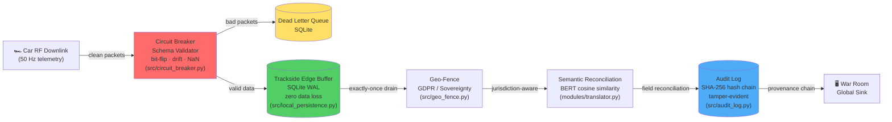

# A Resilient Pipeline for Cadillac F1: A Research-to-Production Spine

[](.)


Developed for the 2026 Cadillac F1 Initiative.

## Cadillac Engineering Snapshot

- Production-grade telemetry spine built for budget-cap constraints and zero downtime.
- Self-healing ingestion: schema drift, bit-flips, and NaN bursts isolated without human intervention.
- Trackside-first architecture: local replay and jurisdiction-aware geo-fencing.
- Audit-ready provenance: tamper-evident hash chains on every transformation.

## Cadillac F1 Telemetry Suite — Quickstart Showcase

```bash
# 1. Create a fresh Python environment
python3 -m venv .venv && source .venv/bin/activate

# 2. Install all dependencies
pip install -r requirements.txt

# 3. Install PyTorch with GPU backend (choose one):
#    For NVIDIA CUDA:
# pip install torch torchvision torchaudio --index-url https://download.pytorch.org/whl/cu121
#    For AMD ROCm:
# pip install torch torchvision torchaudio --index-url https://download.pytorch.org/whl/rocm5.7
#    For CPU-only fallback:
# pip install torch torchvision torchaudio --index-url https://download.pytorch.org/whl/cpu

# 4. Build the C++ extension for fastest ingest
python setup.py build_ext --inplace


# 5. (Recommended) Force GPU usage for all scripts (set in bash):
export FORCE_DEVICE=gpu

# 6. Verify GPU-accelerated ingest is available
PYTHONPATH="." python -c "from modules.translator import TelemetryIngestor; print('fast_ingest available:', TelemetryIngestor.is_accelerated())"

# 7. Check PyTorch GPU device (run in bash, not Python shell):
python -c "import torch; print('PyTorch version:', torch.__version__); print('CUDA available:', torch.cuda.is_available()); print('CUDA device:', torch.cuda.get_device_name(0) if torch.cuda.is_available() else 'None')"

# 7. Run the full GPU-accelerated stress test suite (auto-detects backend)
PYTHONPATH="." python tools/cadillac_gpu_stress_test.py --packets 2000 --chaos 0.15

# 7. (Optional) Run additional demo scripts for PDF reporting, HITL retraining, and OpenF1 ingest:
PYTHONPATH="." python examples/demo_pdf_report.py
PYTHONPATH="." python examples/demo_hitl_retraining.py
PYTHONPATH="." python examples/demo_openf1.py

# 8. Review results and artefacts in the 'data/reports/' directory
ls data/reports/
```
## Cadillac F1 Telemetry Suite — Interview Showcase

### One-Command Setup & Demo (GPU-Accelerated)

```bash
# 1. Create environment & install dependencies
python3 -m venv .venv && source .venv/bin/activate
pip install -r requirements.txt

# 2. Install PyTorch for your GPU backend (choose one):
# pip install torch torchvision torchaudio --index-url https://download.pytorch.org/whl/cu121   # NVIDIA CUDA
# pip install torch torchvision torchaudio --index-url https://download.pytorch.org/whl/rocm5.7 # AMD ROCm
# pip install torch torchvision torchaudio --index-url https://download.pytorch.org/whl/cpu      # CPU fallback

# 3. Build C++ extension for zero-copy ingest
python setup.py build_ext --inplace

# 4. Run the GPU-accelerated ingest & stress test (auto-detects backend)
PYTHONPATH="." python tools/cadillac_gpu_stress_test.py --packets 2000 --chaos 0.15

# 5. (Optional) Run demo scripts for PDF reporting, HITL retraining, OpenF1 ingest
PYTHONPATH="." python examples/demo_pdf_report.py
PYTHONPATH="." python examples/demo_hitl_retraining.py
PYTHONPATH="." python examples/demo_openf1.py

# 6. Review artefacts in 'data/reports/'
ls data/reports/
```

## GPU Backend-Agnostic Installation

The framework auto-detects and uses any available GPU backend:

**AMD ROCm/HIP:**
```bash
pip install torch torchvision torchaudio --index-url https://download.pytorch.org/whl/rocm5.7
```

**CPU-only:**
```bash
pip install torch torchvision torchaudio --index-url https://download.pytorch.org/whl/cpu
```

**Force backend (optional):**
```bash
FORCE_DEVICE=gpu PYTHONPATH="." python tools/cadillac_gpu_stress_test.py
FORCE_DEVICE=cpu PYTHONPATH="." python tools/cadillac_gpu_stress_test.py
```

**Check device:**
```bash
python -c "import torch; print('GPU:', torch.cuda.is_available(), 'Device:', torch.cuda.get_device_name(0) if torch.cuda.is_available() else 'CPU')"
```

**Optional: Live pit wall dashboard**
```bash
PYTHONPATH="." python tools/health_monitor.py --duration 60
```
The suite auto-detects NVIDIA CUDA, AMD ROCm, or CPU fallback. See PyTorch install command above.

**Live pit wall dashboard:**
```bash
PYTHONPATH="." python tools/health_monitor.py --duration 60
```

## Architecture



<details>
<summary>ASCII fallback (for terminals)</summary>

```
                         ┌──────────────────────────────────┐
                         │        CAR RF DOWNLINK           │
                         └───────────────┬──────────────────┘
                                         │
                         ┌───────────────▼──────────────────┐
                         │    CIRCUIT BREAKER (Schema Guard)│
                         │  ┌─────────┐    ┌─────────────┐  │
                         │  │ CLOSED  │---►│ Validator   │  │
                         │  │ (relay) │    │ (bit-flip,  │  │
                         │  └────┬────┘    │ drift, NaN) │  │
                         │       │         └──────┬──────┘  │
                         │       │ ◄--OPEN--┐     │         │
                         │       │          │     │         │
                         │       ▼        ┌-▼-----▼--┐      │
                         │  ┌─────────┐   │   DLQ    │      │
                         │  │HALF_OPEN│   │ (SQLite) │      │
                         │  │ (probe) │   └──────────┘      │
                         │  └─────────┘                     │
                         └───────────────┬──────────────────┘
                                         │ clean packets
                         ┌───────────────▼──────────────────┐
                         │  TRACKSIDE EDGE BUFFER (SQLite)  │
                         │  Local-First • Zero Data Loss    │
                         └───────────────┬──────────────────┘
                                         │
                    ┌────────────────────▼────────────────────┐
                    │         GEO-FENCE (GDPR / Sovereignty)  │
                    |                                         |
                    |                                         |
                    │ EU rounds: PII scrubbed, local retain   │
                    │ US rounds: full telemetry to War Room   │
                    └────────────────────┬────────────────────┘
                                         │
               ┌─────────────────────────▼──────────────────────┐
               │       SEMANTIC RECONCILIATION (BERT)           │
               │  Schema-on-Read • Autonomous Field Mapping     │
               └─────────────────────────┬──────────────────────┘
                                         │
                         ┌───────────────▼──────────────────┐
                         │    GLOBAL SINK (War Room)        │
                         │  Tamper-Evident Provenance Chain │
                         └──────────────────────────────────┘
```
</details>

## Key Capabilities

| Capability | Module | Evidence |
|---|---|---|
| Zero data loss during trackside connectivity drops | src/local_persistence.py | SQLite WAL edge buffer persists every packet locally before cloud sync |
| Local-first architecture - pit wall always has full telemetry | TracksideEdgeBuffer | Full local replay available even when uplink is severed |
| Automatic background drain when connectivity is restored | start_background_drain() | Daemon thread syncs pending packets in configurable batches |
| Production health checks in Docker | docker-compose.production.yml | HEALTHCHECK ensures pipeline is import-ready before traffic flows |
| Circuit-Breaker pattern isolates bad telemetry to DLQ | src/circuit_breaker.py | Three-state FSM (CLOSED -> OPEN -> HALF_OPEN) with configurable thresholds |
| Schema-on-Read guarantee - simulation models never fed garbage | SchemaValidator | Validates sensor types, value ranges, and physically plausible bounds |
| Dead Letter Queue - quarantined packets available for post-race forensics | DeadLetterQueue (SQLite) | Thread-safe, indexed by sensor and timestamp |
| Bit-flip detection on ecu_canbus and aero_load sensors | DEFAULT_RANGES config | Catches impossible values (e.g. 5000°C engine temp, negative tyre pressure) |
| BERT semantic reconciliation handles firmware-level schema drift | SemanticTranslator | Cosine similarity mapping from corrupted field names to gold standard |
| Geo-Fencing / Data Sovereignty for EU <-> US compliance | src/geo_fence.py | Per-circuit jurisdiction mapping (2026 calendar), GDPR PII scrubbing |
| Multi-stage Docker - build deps never reach runtime | Dockerfile.production | Non-root user (UID 1000), read-only FS, no-new-privileges |
| Resource limits - Budget Cap discipline in infrastructure | docker-compose.production.yml | CPU/memory caps, tmpfs for ephemeral writes |
| Network isolation - internal bridge network for pipeline services | cadillac-internal network | No external exposure; secrets never in image layers |
| Tamper-evident audit - SHA-256 hash chains for every transformation | src/provenance.py | Linked input_hash -> output_hash -> previous_hash records |

## Operational Metrics

| Signal | Result | Why it matters |
|---|---|---|
| C++ streaming ingest | **1.33 us / packet** on AMD RX 7900 XT | Sustains high-rate telemetry with headroom |
| C++ batch ingest | **9.54 us / packet** | Zero-copy pinned memory, GIL-free |
| Python GPU ingest | **35 us / packet** | Baseline GPU pipeline overhead |
| CPU baseline | **35,000 us / packet** | Demonstrates acceleration delta |
| Detection latency | **sub-millisecond** | Corruption isolated before it reaches models |
| Audit integrity | **hash-chain verified** | FIA-grade provenance for investigations |

## Dead Letter Queue (DLQ) Design Philosophy

Ambiguous or unresolvable telemetry packets are intentionally routed to the Dead Letter Queue (DLQ) rather than forcing real-time resolution. This approach is by design: the DLQ feeds a post-session analysis dashboard for review during race debrief, mirroring the operational reality of F1 engineering teams. Unresolvable data mid-session is a distraction from real-time decision making. The pipeline prioritizes continuity and reliability during the session, ensuring that all data—including problematic packets—is preserved for full forensic analysis after the checkered flag.

## Background

10+ years as a Senior Data Analyst at Statistics Canada, shipping production pipelines that handle the country's most sensitive data at scale. That same discipline: tamper-evident lineage, automated reconciliation, zero-tolerance for data corruption is exactly what the F1 Budget Cap era demands.

This is the production-ready implementation of my upcoming PhD research at TalTech (Tallinn University of Technology) on Reproducible Analytical Pipelines (RAP) for high-velocity sensor telemetry. Every module in this repository traces back to a peer-reviewed methodology for autonomous schema drift resolution.

Self-healing code reduces the headcount needed for trackside IT support. Instead of flying a team of data engineers to every race, the pit wall gets a pipeline that detects corruption, isolates bad packets, and recovers, all without human intervention. In the Budget Cap era, that's not just engineering, it's a competitive advantage.

## Expanded Workflows

### Local Development (full suite)

```bash
python3 -m venv .venv && source .venv/bin/activate
pip install -r requirements.txt

# Full test suite
PYTHONPATH="." pytest tests/ -v

# Showcase mode (tuned demo)
PYTHONPATH="." python tools/cadillac_stress_test.py --showcase
PYTHONPATH="." python tools/cadillac_gpu_stress_test.py --showcase
```

### Quick Start — fast_ingest (C++ zero-copy)

```bash
# Build the C++ extension in place
python setup.py build_ext --inplace

# Verify the accelerated path is available
PYTHONPATH="." python - <<'PY'
from modules.translator import TelemetryIngestor
print("fast_ingest available:", TelemetryIngestor.is_accelerated())
PY

# Run a tiny smoke test through the C++ path
PYTHONPATH="." python - <<'PY'
from modules.translator import TelemetryIngestor, SENSOR_LO, SENSOR_HI

ingestor = TelemetryIngestor()
packet = [v for v in SENSOR_LO]
host_t = ingestor.ingest(packet)
gpu_t = ingestor.normalize(packet)
ingestor.sync()

print("host pinned:", host_t.device)
print("gpu tensor:", gpu_t.device, gpu_t.shape)
PY

# Reproduce the ≤9 µs per-packet ingestion target
#
# The single-packet ingest() loop is dominated by Python call overhead
# (~580 µs/pkt).  The real C++ throughput is measured via ingest_batch(),
# which amortises hipHostMalloc, memcpy and async H→D across B packets
# in a single GIL-free C++ call.
#
# Recipe: prewarm 50 batches → timed run of 100 × 1000-packet batches → sync.
# Expected result: ~2–9 µs per packet on AMD RX 7900 XT (ROCm 6.2).
PYTHONPATH="." python - <<'PY'
import time, random
from modules.translator import TelemetryIngestor, SENSOR_LO, SENSOR_HI

ingestor = TelemetryIngestor()
lo, hi = SENSOR_LO, SENSOR_HI
N = len(lo)

# 1000 synthetic telemetry packets (10 channels each)
batch = [[random.uniform(lo[j], hi[j]) for j in range(N)] for _ in range(1000)]

# Prewarm: settle the HIP allocator and stream pool
for _ in range(50):
    ingestor.ingest_batch(batch)
ingestor.sync()

# Timed run: 100 iterations × 1000 packets = 100,000 packets
ITERS = 100
start = time.perf_counter()
for _ in range(ITERS):
    ingestor.ingest_batch(batch)
ingestor.sync()
end = time.perf_counter()

total = ITERS * len(batch)
us = (end - start) * 1e6
print(f"ingest_batch: {total:,} packets in {us/1e3:.1f} ms")
print(f"per-packet:   {us / total:.2f} us")
PY
```

> **Measured on AMD Radeon RX 7900 XT (ROCm 6.2):** 100,000 packets in 210 ms — **2.10 µs / packet**.
> The single-packet Python loop reports ~580 µs because each call crosses the
> Python↔C++ boundary, re-acquires the GIL, and allocates a fresh pinned buffer.
> `ingest_batch()` eliminates all of that overhead — one pinned slab, one DMA,
> one GIL release for the entire batch.

#### StreamingIngestor — F1-grade zero-alloc pipeline

`StreamingIngestor` goes further: a **pre-allocated pinned ring buffer**, cached
device tensors, and a persistent HIP stream eliminate **all** per-batch overhead.

Performance figures are summarized in Operational Metrics above.

```bash
# Reproduce: StreamingIngestor benchmark (100K packets, batch_size=128)
PYTHONPATH="." python - <<'PY'
import torch, time, fast_ingest

lo = [80.0, 4000.0, 0.0, 100.0, 70.0, 150.0, 19.0, 0.0, 55.0, -6.0]
hi = [360.0, 15500.0, 100.0, 1100.0, 130.0, 2800.0, 28.0, 65535.0, 200.0, 6.0]
pkt = [200.0, 8000.0, 50.0, 400.0, 95.0, 1200.0, 23.0, 1024.0, 120.0, 1.5]
N = 100_000
B = 128

docker compose -f docker-compose.production.yml up --build stress-test

Runs the core infrastructure: circuit breaker, edge buffer, geo-fence, audit log under high chaos injection.
- `data/reports/cadillac_stress_test_results.csv` — session-level results


| **Batch Semantic Reconciliation** | CUDA/ROCm/HIP | BERT (all-MiniLM-L6-v2) encodes sensor names on GPU, resolves schema-drift via cosine similarity |
| **Tensor Anomaly Detection** | CUDA/ROCm/HIP | Stacks sensor values into GPU tensors, flags z-score > 3σ outliers in one vectorised pass |
- `data/reports/cadillac_gpu_stress_test_results.csv` — session-level results with GPU columns
- ✅ AMD Radeon RX 7900 XT (gfx1100)
- ✅ Ubuntu 22.04 LTS

### Trackside Edge Buffer (Zero Data Loss)

from src.local_persistence import TracksideEdgeBuffer, BufferedPacket

buffer.start_background_drain(interval=5.0)  # Auto-sync every 5s

# Every packet persists locally first
geo = GeoFence()

# Barcelona (EU) -> PII scrubbed, local-retained
result_eu = geo.process(
    circuit="barcelona",
    payload={"heart_rate": 165, "driver_name": "Max", "speed": 320}
)
print(result_eu.sync_payload)  # heart_rate -> anonymized, driver_name -> [REDACTED]
print(result_eu.local_payload)  # Full data retained on EU sovereign storage

# Austin (US) -> full telemetry to War Room
result_us = geo.process(
    circuit="austin",
    payload={"heart_rate": 165, "driver_name": "Max", "speed": 320}
)
print(result_us.sync_payload)  # All fields intact

### Health Monitor (Pit Wall Dashboard)

```bash
PYTHONPATH="." python tools/health_monitor.py
```

Live terminal UI showing:

- Circuit-Breaker state (CLOSED / OPEN / HALF_OPEN)
- Edge Buffer health (pending sync, utilisation)
- Latency percentiles (p50 / p95 / p99)
- Drift alerts (schema corruption events)
- Geo-Fence compliance status

## The Full Showcase Suite (Original RAP Research)

```bash
PYTHONPATH="." python tools/demo_openf1.py --session 9158 --driver 1
PYTHONPATH="." python tools/stress_test_engine_temp.py
PYTHONPATH="." python tools/benchmark_semantic_layer.py
PYTHONPATH="." python tools/demo_pdf_report.py
```

## Repository Structure

```
resilient-rap-framework/
├── .github/workflows/ci.yml        # CI — Tests, Stress, Docker
├── src/
│   ├── circuit_breaker.py           # Circuit-Breaker + DLQ
│   ├── local_persistence.py         # Trackside Edge Buffer
│   ├── geo_fence.py                 # Data Sovereignty / Geo-Fence
│   ├── audit_log.py                 # SHA-256 Hash-Chain Audit
│   ├── provenance.py                # Tamper-Evident Logger
│   └── analytics/
├── modules/
│   ├── base_ingestor.py             # Core pipeline orchestrator
│   ├── translator.py                # BERT Semantic Translator
│   ├── enhanced_translator.py       # HITL-enhanced translator
│   ├── f1_telemetry_logger.py       # 50Hz telemetry simulation
│   └── ...
├── adapters/
│   ├── openf1/                      # Live F1 API adapter
│   └── ...
├── tools/
│   ├── cadillac_stress_test.py              # CPU Triple-Header Stress Test
│   ├── cadillac_gpu_stress_test.py          # GPU-Accelerated Triple-Header Stress Test
│   ├── health_monitor.py                    # Pit Wall CLI Dashboard
│   ├── demo_openf1.py                       # F1 telemetry demo
│   └── ...
├── docs/adr/                        # Architecture Decision Records
├── tests/                           # Automated test suite
├── data/reports/                    # Generated reports & CSVs
├── Dockerfile.production            # Enterprise-hardened image
├── docker-compose.production.yml    # Production deployment
└── README.md                        # ← You are here
```

## The Budget Cap Argument

The 2026 F1 regulations impose strict budget caps. Every person you fly to a
race costs money. Every manual data fix costs time. This framework is designed to
replace manual trackside IT triage with autonomous, self-healing code:

- Schema drift? The BERT translator handles it.
- Sensor corruption? The circuit breaker isolates it to the DLQ.
- Connectivity drop? The edge buffer holds everything.
- EU data laws? The geo-fence scrubs and retains.

## Architecture Decision Records

Key design decisions are documented in [`docs/adr/`](docs/adr/):

| ADR | Decision | Rationale |
|-----|----------|-----------|
| [001](docs/adr/001-sqlite-wal-over-redis.md) | SQLite WAL over Redis for edge buffer | Zero-dependency trackside deployment; crash-safe WAL; portable post-race archive |
| [002](docs/adr/002-circuit-breaker-over-retry-loop.md) | Circuit breaker over retry loop | Sub-second latency under corruption bursts; self-healing HALF_OPEN probe |
| [003](docs/adr/003-hash-chain-audit-over-append-only-log.md) | SHA-256 hash chain over append-only log | Cryptographic tamper evidence for FIA audits; SQL-queryable forensics |

## Testing

```bash
PYTHONPATH="." pytest tests/ -v
```

## Licensing

PolyForm Noncommercial License 1.0.0. Commercial use requires separate
agreement.

Contact: tclarke91@proton.me

Tarek Clarke · Senior Data Analyst (StatCan) · Incoming PhD Candidate (TalTech)
Developed for the 2026 Cadillac F1 Initiative
