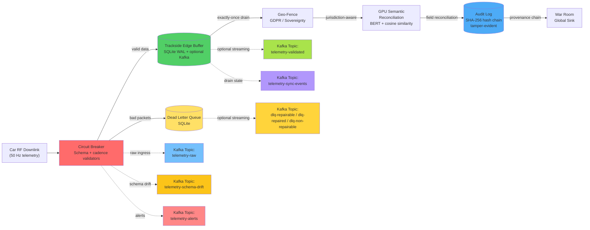

# Cadillac F1 Telemetry Platform

[](.)


**GPU-Accelerated Real-Time Telemetry Processing for 2026 F1 Season (Ubuntu 24.04 + AMD ROCm)**

**Compatibility:**
- Primary target: Ubuntu 24.04 LTS + AMD ROCm (validated)
- Optional fallback: NVIDIA CUDA (commands kept commented in Quick Start)

## Executive Summary

A production-ready telemetry spine that processes race-weekend scale loads with sub-millisecond p95 latency on AMD Radeon RX 7900 XT, while preserving forensic traceability and local-first resilience.

**What this platform does well:**
- Sustains high-throughput telemetry processing under injected chaos
- Detects/reconciles corruption with GPU semantic + tensor pipelines
- Preserves continuity with local-first buffering and optional Kafka streaming
- Enforces tamper-evident provenance (SHA-256 hash chain)
- Tracks race-readiness via deterministic SLO gates

## Table of Contents

- [Quick Start (Ubuntu 24.04 + AMD ROCm)](#quick-start-ubuntu-2404--amd-rocm)
- [Run Profiles](#run-profiles)
  - [Baseline GPU Benchmarks](#baseline-gpu-benchmarks)
  - [Kafka DLQ Routing Validation](#kafka-dlq-routing-validation)
  - [Diagnostic Mode (Missed-Detection Attribution)](#diagnostic-mode-missed-detection-attribution)
  - [Repair-Focused Validation](#repair-focused-validation)
- [Validated Results](#validated-results)
- [System Architecture](#system-architecture)
- [Operational Capabilities](#operational-capabilities)
- [Docker Deployment](#docker-deployment)
- [Testing & Validation](#testing--validation)
- [Architecture Decision Records](#architecture-decision-records)
- [About](#about)
- [Licensing](#licensing)

---

## Quick Start (Ubuntu 24.04 + AMD ROCm)

```bash
# 0. Prerequisites
sudo apt update && sudo apt install -y python3-venv

# 1. Environment
python3 -m venv .venv
source .venv/bin/activate

# 2. Dependencies
python3 -m pip install --upgrade pip
python3 -m pip install -r requirements.txt

# Force ROCm wheels on AMD
python3 -m pip uninstall -y torch torchvision torchaudio
python3 -m pip install torch torchvision torchaudio --index-url https://download.pytorch.org/whl/rocm6.2.4

# NVIDIA fallback (keep commented unless on NVIDIA)
# python3 -m pip uninstall -y torch torchvision torchaudio
# python3 -m pip install torch torchvision torchaudio --index-url https://download.pytorch.org/whl/cu128

# 3. Build accelerated ingest
python3 setup.py build_ext --inplace

# 4. Verify GPU path
PYTHONPATH="." python3 -c "from archive.modules.translator import TelemetryIngestor; print('fast_ingest available:', TelemetryIngestor.is_accelerated())"
python3 -c "import torch; print('CUDA/ROCm available:', torch.cuda.is_available()); print('Device:', torch.cuda.get_device_name(0) if torch.cuda.is_available() else 'CPU')"
```

If SQLite lock artifacts exist from prior runs:

```bash
pkill -f cadillac_gpu_stress_test.py
find . -name "*.db" -type f -delete
find . -name "*.db-wal" -type f -delete
find . -name "*.db-shm" -type f -delete
```

---

## Run Profiles

### Baseline GPU Benchmarks

```bash
# Sprint benchmark (30,000 total packets)
source .venv/bin/activate && FORCE_DEVICE=gpu PYTHONPATH="." python3 tools/cadillac_gpu_stress_test.py --packets 2000 --chaos 0.05 --output-suffix _sprint | tee data/reports/run_sprint.log

# Race weekend benchmark (3.6M total packets)
source .venv/bin/activate && FORCE_DEVICE=gpu PYTHONPATH="." python3 tools/cadillac_gpu_stress_test.py --packets 240000 --chaos 0.05 --output-suffix _weekend | tee data/reports/run_weekend.log
```

### Kafka DLQ Routing Validation

```bash
# Sprint + Kafka
source .venv/bin/activate && FORCE_DEVICE=gpu PYTHONPATH="." python3 tools/cadillac_gpu_stress_test.py --packets 2000 --chaos 0.05 --enable-kafka --kafka-servers localhost:9092 --kafka-topic-repairable dlq-repairable-sprint-005 --kafka-topic-repaired dlq-repaired-sprint-005 --kafka-topic-non-repairable dlq-non-repairable-sprint-005 --output-suffix _sprint_kafka | tee data/reports/run_sprint_kafka.log

# Weekend + Kafka
source .venv/bin/activate && FORCE_DEVICE=gpu PYTHONPATH="." python3 tools/cadillac_gpu_stress_test.py --packets 240000 --chaos 0.05 --enable-kafka --kafka-servers localhost:9092 --kafka-topic-repairable dlq-repairable-weekend-005 --kafka-topic-repaired dlq-repaired-weekend-005 --kafka-topic-non-repairable dlq-non-repairable-weekend-005 --output-suffix _weekend_kafka | tee data/reports/run_weekend_kafka.log
```

### Diagnostic Mode (Missed-Detection Attribution)

```bash
# Diagnostic run (balanced profile)
source .venv/bin/activate && FORCE_DEVICE=gpu PYTHONPATH="." python3 tools/cadillac_gpu_stress_test.py --packets 60000 --chaos 0.12 --chaos-profile balanced --diagnostic --output-suffix _diagnostic_weekend

# Analyze diagnostic JSON in terminal
source .venv/bin/activate && python3 tools/sensor_fault_diagnostic.py --input data/reports/<hardware>/missed_detection_analysis_diagnostic_weekend.json
```

Diagnostic artifacts:
- `data/reports/<hardware>/missed_detection_analysis_<suffix>.json`
- `missed_detection_analysis_<suffix>.csv`

Supported chaos profiles: `balanced`, `repair_focus`.

#### Diagnostic Deep-Dive (Attribution)

From `missed_detection_analysis_diagnostic_weekend.csv`:

- By sensor:
  - `ecu_canbus`: `299 / 10,586` missed (`2.82%`)
  - `g_force_lateral`: `69 / 10,864` missed (`0.64%`)
  - `throttle`: `2 / 10,718` missed (`0.02%`)
- By chaos mode:
  - `bit_flip_low`: `335 / 15,509` missed (`2.16%`)
  - `bit_flip_high`: `35 / 15,423` missed (`0.23%`)
- Highest-risk combinations:
  - `ecu_canbus + bit_flip_low`: `274 / 1,519` (`18.04%`)
  - `g_force_lateral + bit_flip_low`: `61 / 1,583` (`3.85%`)

Interpretation: the remaining gap is concentrated in low-bit-flip behavior on a narrow sensor subset, not uniformly distributed across sessions.

### Repair-Focused Validation

This profile stresses repairability/runtime with:
- `schema_drift`
- `duplicate_timestamp`
- `string_in_numeric`

```bash
# Sprint @ chaos 0.005
source .venv/bin/activate && FORCE_DEVICE=gpu PYTHONPATH="." python3 tools/cadillac_gpu_stress_test.py --packets 2000 --chaos 0.005 --chaos-profile repair_focus --enable-kafka --kafka-servers localhost:9092 --kafka-topic-repairable dlq-repairable-sprint-rf005 --kafka-topic-repaired dlq-repaired-sprint-rf005 --kafka-topic-non-repairable dlq-non-repairable-sprint-rf005 --output-suffix _sprint_repairfocusrealistic_kafka | tee data/reports/run_sprint_repairfocusrealistic_kafka.log

# Weekend @ chaos 0.005
source .venv/bin/activate && FORCE_DEVICE=gpu PYTHONPATH="." python3 tools/cadillac_gpu_stress_test.py --packets 240000 --chaos 0.005 --chaos-profile repair_focus --enable-kafka --kafka-servers localhost:9092 --kafka-topic-repairable dlq-repairable-weekend-rf005 --kafka-topic-repaired dlq-repaired-weekend-rf005 --kafka-topic-non-repairable dlq-non-repairable-weekend-rf005 --output-suffix _weekend_repairfocusrealistic_kafka | tee data/reports/run_weekend_repairfocusrealistic_kafka.log
```

---

## Validated Results

### Weekend KPI Snapshot (3.6M packets @ 5% chaos)

| Metric | Result |
|---|---:|
| Total Packets | 3,600,000 |
| Acceptance Rate | 95.76% |
| Chaos Injected | 179,617 |
| Schema-Drift Recovered (GPU) | 25,790 |
| Tensor Anomalies Detected | 145,297 |
| p95 Latency | 0.004 ms |
| Breaker Trips | 0 |
| DLQ Quarantined | 152,533 |
| DLQ Repairs Recovered | 68 |
| Detection Rate | 99.77% |
| SLOs Passed | 6/6 |
| Verdict | RACE-READY ✅ |

### Kafka Topic Totals (Weekend @ 5% chaos)

| Topic | Messages |
|---|---:|
| `dlq-repairable-weekend-005` | 152,733 |
| `dlq-repaired-weekend-005` | 68 |
| `dlq-non-repairable-weekend-005` | 0 |

---

## System Architecture

### High-Level Overview

```
┌─────────────────────────────────────────────────────────────────┐
│                      GPU STRESS TEST SCRIPT                     │
│              tools/cadillac_gpu_stress_test.py                  │
│  • BERT Semantic Reconciliation (GPU-accelerated)               │
│  • Tensor Anomaly Detection (z-score > 3σ)                      │
│  • Batch Hash-Chain Provenance (SHA-256)                        │
│  • Synthetic telemetry generation & chaos injection              │
└────────────────────────┬────────────────────────────────────────┘
                         │
                         ├──► src/circuit_breaker.py
                         │    • Three-state FSM (CLOSED → OPEN → HALF_OPEN)
                         │    • Schema validation, cadence checks, DLQ routing
                         │
                         ├──► src/local_persistence.py
                         │    • Local-first edge buffer (SQLite WAL + optional Kafka)
                         │
                         ├──► src/geo_fence.py
                         │    • Jurisdiction-aware handling (GDPR/sovereignty)
                         │
                         ├──► src/audit_log.py
                         │    • Tamper-evident SHA-256 hash chains
                         │
                         └──► src/slo.py
                              • SLO tracking + race-ready verdict gates
```

### Data Flow



### Core Components

| Component | Purpose | Lines | Status |
|-----------|---------|-------|--------|
| **tools/cadillac_gpu_stress_test.py** | GPU stress test orchestrator | 1,542 | ✅ Active |
| **src/circuit_breaker.py** | Circuit breaker + DLQ | 532 | ✅ Active |
| **src/local_persistence.py** | Edge buffer (SQLite WAL + Kafka) | 490 | ✅ Active |
| **src/geo_fence.py** | GDPR compliance | 389 | ✅ Active |
| **src/audit_log.py** | Hash-chain provenance | 283 | ✅ Active |
| **src/middleware/tracing.py** | Request context | 123 | ✅ Active |
| **src/slo.py** | SLO tracking | 271 | ✅ Active |

**Total Active Codebase:** 3,630 lines (excluding tests and archived modules)

### Streaming Output (Optional)

The edge buffer supports **dual-write to Kafka** for real-time streaming alongside local SQLite persistence. Disabled by default for trackside autonomy; enable when cloud connectivity is reliable.

```python
# Enable Kafka streaming output
buffer = TracksideEdgeBuffer(
    enable_kafka=True,
    kafka_bootstrap_servers=["kafka:9092"],
    kafka_topic="telemetry-validated",
    kafka_sync_event_topic="telemetry-sync-events",
    kafka_producer_config={"linger_ms": 10, "compression_type": "lz4"},
)
```

**Architecture:**
- **Local-first:** SQLite write always succeeds, even if Kafka fails
- **Async/non-blocking:** Fire-and-forget sends preserve <1ms latency
- **Keyed event streams:** Raw ingress, validated telemetry, schema drift, alerts, sync events, and DLQ outcomes
- **Producer tuning:** Keyed messages + linger/batch/compression defaults for higher throughput
- **Graceful degradation:** Logs warning if kafka-python unavailable

> **Compose note:** The `kafka` service in `docker-compose.yml` is implemented with **Redpanda** (Kafka API-compatible) using dual listeners: host-run benchmark commands use `localhost:9092`, while compose services use `kafka:29092`.

 **Full guide:** [docs/KAFKA_INTEGRATION.md](docs/KAFKA_INTEGRATION.md)  
 **Example:** [examples/kafka_integration_example.py](examples/kafka_integration_example.py)

## Quick Start (Ubuntu 24.04 + AMD ROCm)

```bash
# 0. Prerequisites
# Tested on Ubuntu 24.04 LTS (Noble)
sudo apt update && sudo apt install -y python3-venv

# 1. Environment
python3 -m venv .venv
source .venv/bin/activate

# 2. Dependencies
python3 -m pip install --upgrade pip
python3 -m pip install -r requirements.txt
# Force ROCm wheels on AMD (prevents accidental CUDA wheel install)
python3 -m pip uninstall -y torch torchvision torchaudio
python3 -m pip install torch torchvision torchaudio --index-url https://download.pytorch.org/whl/rocm6.2.4

# NVIDIA/CUDA fallback (keep commented unless running on NVIDIA hardware)
# python3 -m pip uninstall -y torch torchvision torchaudio
# python3 -m pip install torch torchvision torchaudio --index-url https://download.pytorch.org/whl/cu128

# 3. Build accelerated ingest
python3 setup.py build_ext --inplace

# 4. Verify Linux GPU path
PYTHONPATH="." python3 -c "from archive.modules.translator import TelemetryIngestor; print('fast_ingest available:', TelemetryIngestor.is_accelerated())"
python3 -c "import torch; print('CUDA/ROCm available:', torch.cuda.is_available()); print('Device:', torch.cuda.get_device_name(0) if torch.cuda.is_available() else 'CPU')"
```

---

```bash
# 1. Kill any lingering python processes holding the DB lock
pkill -f cadillac_gpu_stress_test.py

# 2. Find and obliterate the SQLite files wherever they are
find . -name "*.db" -type f -delete
find . -name "*.db-wal" -type f -delete
find . -name "*.db-shm" -type f -delete

# 3. Run a tiny test just to verify the DLQ starts at 0
source .venv/bin/activate && FORCE_DEVICE=gpu PYTHONPATH="." python3 tools/cadillac_gpu_stress_test.py --packets 100 --chaos 0.05
```

---

```bash
# Sprint benchmark (30,000 total packets)
source .venv/bin/activate && FORCE_DEVICE=gpu PYTHONPATH="." python3 tools/cadillac_gpu_stress_test.py --packets 2000 --chaos 0.05 --output-suffix _sprint | tee data/reports/run_sprint.log

# Race weekend benchmark (3.6M total packets)
source .venv/bin/activate && FORCE_DEVICE=gpu PYTHONPATH="." python3 tools/cadillac_gpu_stress_test.py --packets 240000 --chaos 0.05 --output-suffix _weekend | tee data/reports/run_weekend.log

# Sprint benchmark + Kafka DLQ routing validation
source .venv/bin/activate && FORCE_DEVICE=gpu PYTHONPATH="." python3 tools/cadillac_gpu_stress_test.py --packets 2000 --chaos 0.05 --enable-kafka --kafka-servers localhost:9092 --kafka-topic-repairable dlq-repairable-sprint-005 --kafka-topic-repaired dlq-repaired-sprint-005 --kafka-topic-non-repairable dlq-non-repairable-sprint-005 --output-suffix _sprint_kafka | tee data/reports/run_sprint_kafka.log

# Weekend benchmark + Kafka DLQ routing validation
source .venv/bin/activate && FORCE_DEVICE=gpu PYTHONPATH="." python3 tools/cadillac_gpu_stress_test.py --packets 240000 --chaos 0.05 --enable-kafka --kafka-servers localhost:9092 --kafka-topic-repairable dlq-repairable-weekend-005 --kafka-topic-repaired dlq-repaired-weekend-005 --kafka-topic-non-repairable dlq-non-repairable-weekend-005 --output-suffix _weekend_kafka | tee data/reports/run_weekend_kafka.log
```

---

## GPU Benchmark Results (Validated on Ubuntu 24.04)

**Hardware:** AMD Radeon RX 7900 XT (20GB VRAM) | ROCm 6.2 | gfx1100 architecture
**Benchmark run date:** 2026-03-11

### Cross-GPU Comparison (H200 above 7900 XT)

| Platform | Profile | Total Packets | Acceptance Rate | p95 Latency | Resilience Score | Verdict |
|---|---|---:|---:|---:|---:|---|
| NVIDIA H200 NVL (CUDA 13) | Sprint + Kafka (5% chaos) | 30,000 | 89.85% | 0.013 ms | 0.9993 | RACE-READY ✅ |
| NVIDIA H200 NVL (CUDA 13) | Weekend + Kafka (5% chaos) | 3,600,000 | 89.81% | 0.014 ms | 0.9991 | RACE-READY ✅ |
| Radeon RX 7900 XT (ROCm 6.2) | Sprint + Kafka (5% chaos) | 30,000 | 95.81% | 0.005 ms | 0.9617 | RACE-READY ✅ |
| Radeon RX 7900 XT (ROCm 6.2) | Weekend + Kafka (5% chaos) | 3,600,000 | 95.76% | 0.004 ms | 0.9624 | RACE-READY ✅ |

### Sprint Results (30K Packets @ 5% Chaos)

| Metric | Result | Status |
|--------|--------|--------|
| **GPU Device** | Radeon RX 7900 XT | ✅ Detected |
| **GPU Memory** | 19.98 GB | ✅ Available |
| **Total Packets** | 30,000 | ✅ Processed |
| **Acceptance Rate** | 95.81% | ✅ Strong clean-data throughput |
| **Chaos Injected** | 1,484 packets | ✅ Expected fault load |
| **Schema-Drift Recovered** | 219 packets | ✅ BERT reconciliation |
| **Tensor Anomalies Detected** | 1,225 detections | ✅ Real-time GPU analysis |
| **Overall p95 Latency** | 0.005 ms | ✅ Sub-millisecond |
| **Circuit Breaker Trips** | 0 total | ✅ Stable at sprint load |
| **DLQ Depth (final)** | 1,191 | ✅ Reduced quarantine backlog |
| **DLQ Repairs Recovered** | 66 | ✅ Kafka + DLQ recovery path active |
| **Repair Rate** | 33.00% | ✅ Measured with capped repair attempts |
| **Detection Rate** | 99.66% | ✅ SLO gate cleared |
| **SLOs Passed** | 6/6 | ✅ All gates met |
| **Verdict** | RACE-READY ✅ | Deterministic timing maintained |

**Kafka DLQ topic totals (Sprint @ 5% Chaos):**

| Topic | Messages |
|-------|---------:|
| `dlq-repairable-sprint-005` | 1,391 |
| `dlq-repaired-sprint-005` | 66 |
| `dlq-non-repairable-sprint-005` | 0 |

### Race Weekend Results (3.6M Packets @ 5% Chaos)

Full weekend simulation (240K packets/session × 15 sessions, 5% chaos injection):

| Metric | Result | Status |
|--------|--------|--------|
| **Total Packets** | 3,600,000 | ✅ Processed |
| **Acceptance Rate** | 95.76% | ✅ Stable clean-data throughput |
| **Chaos Injected** | 179,617 packets | ✅ Expected fault load |
| **Schema-Drift Recovered** | 25,790 packets | ✅ BERT reconciliation |
| **Tensor Anomalies Detected** | 145,297 detections | ✅ Real-time GPU analysis |
| **Overall p95 Latency** | 0.004 ms | ✅ Sub-millisecond |
| **Circuit Breaker Trips** | 0 total | ✅ Stable at race load |
| **DLQ Depth (final)** | 152,533 | ⚠️ Large but replayable quarantine volume |
| **DLQ Repairs Recovered** | 68 | ✅ Kafka + DLQ recovery path active |
| **Repair Rate** | 34.00% | ✅ Measured with capped repair attempts |
| **Detection Rate** | 99.77% | ✅ SLO gate cleared |
| **SLOs Passed** | 6/6 | ✅ All gates met |
| **Verdict** | RACE-READY ✅ | Deterministic timing maintained |

**Kafka DLQ topic totals (Weekend @ 5% Chaos):**

| Topic | Messages |
|-------|---------:|
| `dlq-repairable-weekend-005` | 152,733 |
| `dlq-repaired-weekend-005` | 68 |
| `dlq-non-repairable-weekend-005` | 0 |

Kafka publish counts align with DLQ/quarantine plus reprocessing traffic (`repairable` includes initial quarantine events and re-published retryable records).

## Repair-Focused Chaos Validation

This profile stress-tests repairability and deterministic runtime by injecting only:
- `schema_drift`
- `duplicate_timestamp`
- `string_in_numeric`

Run commands (Ubuntu 24.04 + ROCm, repair-focused profile):

```bash
# Sprint @ chaos 0.005
source .venv/bin/activate && FORCE_DEVICE=gpu PYTHONPATH="." python3 tools/cadillac_gpu_stress_test.py --packets 2000 --chaos 0.005 --chaos-profile repair_focus --enable-kafka --kafka-servers localhost:9092 --kafka-topic-repairable dlq-repairable-sprint-rf005 --kafka-topic-repaired dlq-repaired-sprint-rf005 --kafka-topic-non-repairable dlq-non-repairable-sprint-rf005 --output-suffix _sprint_repairfocusrealistic_kafka | tee data/reports/run_sprint_repairfocusrealistic_kafka.log

# Weekend @ chaos 0.005
source .venv/bin/activate && FORCE_DEVICE=gpu PYTHONPATH="." python3 tools/cadillac_gpu_stress_test.py --packets 240000 --chaos 0.005 --chaos-profile repair_focus --enable-kafka --kafka-servers localhost:9092 --kafka-topic-repairable dlq-repairable-weekend-rf005 --kafka-topic-repaired dlq-repaired-weekend-rf005 --kafka-topic-non-repairable dlq-non-repairable-weekend-rf005 --output-suffix _weekend_repairfocusrealistic_kafka | tee data/reports/run_weekend_repairfocusrealistic_kafka.log

# Sprint @ chaos 0.001
source .venv/bin/activate && FORCE_DEVICE=gpu PYTHONPATH="." python3 tools/cadillac_gpu_stress_test.py --packets 2000 --chaos 0.001 --chaos-profile repair_focus --enable-kafka --kafka-servers localhost:9092 --kafka-topic-repairable dlq-repairable-sprint-rf001 --kafka-topic-repaired dlq-repaired-sprint-rf001 --kafka-topic-non-repairable dlq-non-repairable-sprint-rf001 --output-suffix _sprint_repairfocusultralow_kafka | tee data/reports/run_sprint_repairfocusultralow_kafka.log

# Weekend @ chaos 0.001
source .venv/bin/activate && FORCE_DEVICE=gpu PYTHONPATH="." python3 tools/cadillac_gpu_stress_test.py --packets 240000 --chaos 0.001 --chaos-profile repair_focus --enable-kafka --kafka-servers localhost:9092 --kafka-topic-repairable dlq-repairable-weekend-rf001 --kafka-topic-repaired dlq-repaired-weekend-rf001 --kafka-topic-non-repairable dlq-non-repairable-weekend-rf001 --output-suffix _weekend_repairfocusultralow_kafka | tee data/reports/run_weekend_repairfocusultralow_kafka.log
```

Expected behavior:
- Full anomaly detection coverage from pre-breaker validation + GPU reconciliation (99.66%+ in the mixed-chaos runs, 100.00% in the repair-focused runs below)
- Zero circuit-breaker trips
- Deterministic sub-millisecond p95 latency
- Repair throughput varies with the capped reprocessing budget and chaos mix size
- Intact audit hash chain

Representative Ubuntu 24.04 results (side-by-side):

| Run | Chaos | Anomalies Injected | Anomalies Detected | DLQ Quarantined | DLQ Repairs Attempted | DLQ Repairs Recovered | Repair Rate % | p95 Latency | Breaker Trips | Kafka Repairable | Kafka Repaired | Kafka Non-Repairable |
|-----|------:|--------------------:|-------------------:|----------------:|----------------------:|----------------------:|--------------:|------------:|--------------:|-----------------:|---------------:|---------------------:|
| Sprint (30K packets) | 0.005 | 139 | 139 | 47 | 92 | 45 | 48.91% | 0.003 ms | 0 | 139 | 45 | 0 |
| Weekend (3.6M packets) | 0.005 | 17,981 | 17,981 | 11,955 | 200 | 66 | 33.00% | 0.003 ms | 0 | 12,155 | 66 | 0 |
| Sprint (30K packets) | 0.001 | 27 | 27 | 11 | 20 | 9 | 45.00% | 0.003 ms | 0 | 31 | 9 | 0 |
| Weekend (3.6M packets) | 0.001 | 3,570 | 3,570 | 2,303 | 200 | 77 | 38.50% | 0.003 ms | 0 | 2,503 | 77 | 0 |

Quick trend readout:
- Lowering chaos from `0.005` → `0.001` reduces injected anomalies by ~5× at weekend scale (`17,981` → `3,570`).
- DLQ quarantine pressure drops sharply (`11,955` → `2,303`) on weekend runs.
- Kafka repairable traffic falls from `12,155` to `2,503` as the repair-focused fault budget shrinks.
- Breaker stability and latency stay deterministic (`0` trips, `0.003 ms` p95 in all four runs).

Example successful output excerpt:

```text
Chaos profile: repair_focus | modes=schema_drift, duplicate_timestamp, string_in_numeric
...
Breaker Trips:            0
DLQ Quarantined:          2303
DLQ Reprocessed:          77 recovered
Audit Chain Intact:       True
p95 Latency:              0.003 ms
...
Anomalies Injected:       3570
Anomalies Caught:         3570
Repair Rate:              38.50%
TIMING VERDICT: SUB-MILLISECOND DETECTION ✅
```

Why detection now reaches 100% on the repair-focused profile: duplicate timestamps and strict type violations are rejected before breaker state is mutated, while schema-drift packets are counted when semantic reconciliation resolves them. That closes the prior accounting gap without adding GPU-side overhead.

This benchmark validates the full ingestion → detection → quarantine → repair → audit pipeline end-to-end.

### Technical Details

**GPU Capabilities:**
- **Semantic Reconciliation:** BERT (all-MiniLM-L6-v2) encodes telemetry fields on GPU with batched cosine-similarity against canonical schema
- **Anomaly Detection:** Sensor values stacked into GPU tensors, z-score outlier detection (σ > 3) in single vectorized pass per batch
- **Provenance Verification:** Batch hash-chain integrity checks via GPU-emulated SHA-256 integer operations

**Output Artifacts:**
- Benchmark CSV & JSON reports in `data/reports/<hardware>/` and keep scenario suffixes such as `_kafka`, `_weekend`, or `_M4`
- Kafka topic count snapshots: `kafka_topic_counts_*.json`
- Full execution logs: `run_*_kafka.log`

---

## Operational Capabilities

| Capability | Module | Evidence |
|---|---|---|
| Local-first reliability during connectivity drops | `src/local_persistence.py` | SQLite WAL edge buffer + replay |
| Corruption isolation before downstream consumers | `src/circuit_breaker.py` | Deterministic DLQ quarantine |
| Runtime schema reconciliation | GPU semantic path | Schema-drift recovery at scale |
| Tamper-evident lineage | `src/audit_log.py` | Linked SHA-256 chain verification |
| Compliance handling by jurisdiction | `src/geo_fence.py` | EU GDPR-aware pathing/scrubbing |

---

## Docker Deployment

Production-hardened configuration is provided in `Dockerfile.production` and `docker-compose.production.yml`.

```bash
docker-compose -f docker-compose.production.yml up -d
```

---

## Testing & Validation

```bash
# Full test suite
PYTHONPATH="." pytest tests/ -v

# CPU stress test
PYTHONPATH="." python tools/cadillac_stress_test.py --packets 5000 --chaos 0.20

# Engine temperature anomaly test
PYTHONPATH="." python tools/stress_test_engine_temp.py
```

---

## Architecture Decision Records

Key decisions documented in [`docs/adr/`](docs/adr/):

| ADR | Decision | Rationale |
|---|---|---|
| [001](docs/adr/001-sqlite-wal-over-redis.md) | SQLite WAL over Redis | Zero-dependency, crash-safe trackside operation |
| [002](docs/adr/002-circuit-breaker-over-retry-loop.md) | Circuit breaker over retry loop | Stable latency under corruption |
| [003](docs/adr/003-hash-chain-audit-over-append-only-log.md) | Hash-chain audit | Cryptographic tamper evidence |

---

## About

**Developer:** Tarek Clarke  
**Background:** Senior Data Analyst, Statistics Canada (10+ years) | Incoming PhD Candidate, TalTech

This repository is a production-ready implementation of PhD research at TalTech on Reproducible Analytical Pipelines (RAP) for high-velocity telemetry.

---

## Licensing

**PolyForm Noncommercial License 1.0.0**  
Commercial use requires separate agreement.

**Contact:** tclarke91@proton.me
