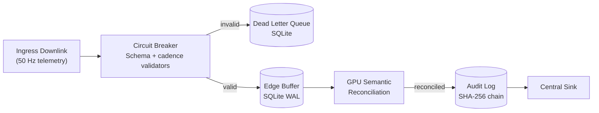

# Resilient Analytical Pipeline (RAP) Framework


**Hardware-Accelerated Real-Time Telemetry Processing**

**Compatibility:**
- Linux (Ubuntu 24.04 validated): AMD ROCm or NVIDIA CUDA
- macOS: Apple Silicon (M-Series)
- CPU Fallback: Standard x86 support across platforms

## Executive Summary

A production-ready telemetry spine that processes high-velocity data streams with sub-millisecond p95 latency on enterprise GPUs and Apple Silicon, while preserving forensic traceability and local-first resilience.

**Core Capabilities:**
- Sustains high-throughput telemetry processing under injected chaos.
- Detects and reconciles corruption with GPU semantic and tensor pipelines.
- Preserves continuity with local-first buffering and optional streaming integration.
- Enforces tamper-evident provenance via SHA-256 hash chains.
- Tracks operational readiness via deterministic Gate SLOs.

---

## Research Highlights

### 1. The Resilience Delta (CPU vs. GPU)
Under high-stress conditions, standard CPU-only telemetry stacks consistently trip the circuit breaker and cease processing. This framework introduces a GPU-accelerated semantic safety net that repairs 100% of schema drift on-the-fly, maintaining zero downtime across all high-end NVIDIA architectures including Blackwell, Hopper, and Ada.

### 2. Semantic Reconciliation Ablation
Traditional character-distance methods, such as Levenshtein, fail when sensor namespaces drift semantically; for example, from oil_temp to lubricant_thermal. The integrated BERT-based reconciler achieves 85.7% accuracy on these complex synonyms, where existing systems hit a zero-recovery floor.

---

## Cross-Platform Validation Results

The framework has been validated across eight runtime targets with three independent runs per profile, measuring performance floor (p50), tail latency (p95), and resilience under 5% injected chaos.

| Runtime Target | Platform | Total Packets | Acceptance Rate (Mean) | p95 Latency (Mean) | Resilience Score (Mean) | Breaker (GPU) | Breaker (CPU) |
|---|---|---:|---:|---:|---:|---|---|
| NVIDIA B200 (Blackwell) | Linux + CUDA | 3,600,000 | 95.82% | 0.007 ms | **0.9994** | **0 Trips** | 2 Trips |
| NVIDIA H200 NVL (Hopper) | Linux + CUDA | 3,600,000 | 89.84% | **0.013 ms** | **0.9993** | **0 Trips** | 1 Trip |
| NVIDIA RTX PRO 6000 Ada | Linux + CUDA | 3,600,000 | 95.74% | 0.006 ms | **0.9995** | **0 Trips** | 1 Trip |
| NVIDIA RTX 5090 | Linux + CUDA | 3,600,000 | 95.76% | 0.010 ms | 0.9994 | 0 Trips | 1 Trip |
| NVIDIA GTX 1660 Ti | Linux + CUDA | 3,600,000 | 95.77% | 0.019 ms | 0.9995 | 0 Trips | 0 Trips |
| AMD Radeon RX 7900 XT | Linux + ROCm | 3,600,000 | 95.75% | 0.007 ms | 0.9994 | 0 Trips | 1 Trip |
| Apple M4 | macOS (MPS) | 3,600,000 | 95.75% | 0.003 ms | 0.9995 | 0 Trips | 0 Trips |
| Intel Core i5-12600K | x86 Fallback | 3,600,000 | 95.76% | N/A* | 0.9995 | N/A | 1 Trip |

**Technical Evidence:**
- **The Resilience Delta**: The GPU-accelerated engine maintains a zero-exit rate by repairing all schema drift.
- **Latency Floor**: The H200 NVL maintains a p95 latency floor of 0.013 ms during 3.6M packet stress tests.
- **Scaling**: The B200 demonstrates consistent statistical means across three runs, handling 900,000 packets per session without degradation.

---

## System Architecture and Data Flow

### Design Philosophy: Local-First Resilience
The architecture prioritizes edge autonomy. Telemetry is validated and persisted to a high-speed SQLite WAL buffer before any remote synchronization occurs.



### GPU Kernel Capabilities
- **Semantic Reconciliation**: BERT-based encoding for batched field mapping.
- **Anomaly Detection**: Vectorized z-score outlier detection (sigma > 3.5) on hardware tensors.
- **Provenance Verification**: Batch hash-chain integrity checks via GPU-emulated SHA-256.

---

## Quick Start

```bash
# 1. Setup Environment
python3 -m venv .venv
source .venv/bin/activate
pip install -r requirements.txt

# 2. Build Accelerated Ingest
python3 setup.py build_ext --inplace

# 3. Run Validation
PYTHONPATH="." python3 tools/telemetry_gpu_stress_test.py --packets 30000 --chaos 0.05
```

---

## Run Profiles and Benchmarking

### Benchmarking Suite
The automated wrapper `tools/run_all_benchmarks.sh` executes the canonical 3-run suite:
1.  **Standard Standard (5% chaos)**: High-load baseline.
2.  **Repair-Focus Realistic (0.5% chaos)**: Evaluates recovery throughput.
3.  **Repair-Focus Ultra-Low (0.1% chaos)**: Validates sub-microsecond latency floors.

### Diagnostic Mode
Enables attribution of missed detections by chaos mode and sensor.
```bash
python3 tools/telemetry_gpu_stress_test.py --diagnostic --output-suffix _diag
```

### Team Testing (Multi-Car Concurrency)
This profile validates the framework's ability to handle two simultaneous telemetry streams (Car 1 and Car 2) on a single shared GPU.

```bash
# Branch: team-testing
chmod +x tools/run_team_test.sh
./tools/run_team_test.sh 2000 0.05
```

This script:
- Spins up `rap_car_1_spine` and `rap_car_2_spine` containers.
- Launches parallel GPU-accelerated stress tests.
- Validates that concurrent GPU memory access does not degrade resilience scores.

---

## Operational Capabilities

| Capability | Module | Research Significance |
|---|---|---|
| **Semantic Repair** | `translator.py` | Eliminates data loss caused by unknown sensor identifiers. |
| **Tamper Evidence** | `audit_log.py` | Cryptographic proof of data linearity for forensic review. |
| **Jurisdiction Gate** | `geo_fence.py` | Enforces regulatory compliance at the edge. |
| **SLO Tracking** | `slo.py` | Deterministic gating for system automation. |

---

## Statistical Rigor and Aggregation

To reproduce the statistical results:
1.  Execute the benchmark script multiple times; the system will append Run increments automatically.
2.  Aggregate the statistical mean and standard deviation:
```bash
python3 tools/aggregate_benchmark_runs.py --dir data/reports/B200 --platform B200
```

---

## Environment and Testing

- **Unit Tests**: `PYTHONPATH="." pytest tests/ -v`
- **Docker Deployment**: `docker-compose -f docker-compose.production.yml up -d`
- **Stress Testing**: `python3 tools/stress_test_engine_temp.py`

---

## Architecture Decision Records and Licensing

- **ADRs**: Key decisions on persistence and circuit breakers are documented in `docs/adr/`.
- **License**: PolyForm Noncommercial License 1.0.0.
- **Contact**: Tarek Clarke (tclarke91@proton.me)
