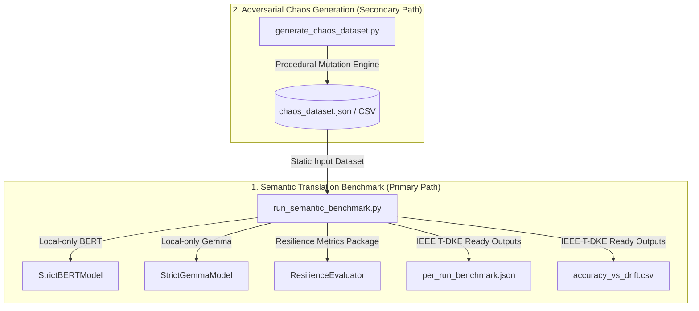

# Resilient Semantic Reconciliation under Drift (IEEE T-DKE Refactored Framework)

This repository implements the refactored, academic-grade benchmark framework designed to support a PhD-grade **IEEE Transactions on Knowledge and Data Engineering (T-DKE)** paper on **Resilient Semantic Reconciliation under API Schema Drift**.

---

## 🏛️ Architectural Overview & Separation of Concerns

To ensure scientific rigor, reproducibility, and a clean experimental setup, the framework is strictly partitioned into **two clean, independent pathways**:



### 1. Semantic Translation Benchmark (Primary Scientific Pathway)
* **Directory**: `semantic_benchmark/`
* **Core Responsibilities**: 
  - Off-line evaluation of semantic drift detection and reconciliation algorithms.
  - Supports four reconcilers as first-class citizens: **Regex**, **Levenshtein**, **BERT** (sentence-transformers), and **Gemma** (generative LLM).
  - Implements detailed method attribution (metrics captured per run: `match_score`, `confidence`, `latency_ms`, `fallback_used`, `fallback_reason`).
  - Utilizes `resilience-metrics` for mathematical resilience profiling.
  - **Offline Enforced**: Zero cloud handshakes or API calls. Asserts `HF_HUB_OFFLINE=1` at runtime.

### 2. Adversarial Chaos Generation (Secondary Tooling Pathway)
* **Directory**: `chaos_generator/`
* **Core Responsibilities**:
  - Procedural mutation synthesis (JSON corruption, schema mutation, paraphrase drift, and LLM-driven adversarial renames).
  - Produces static, replayable chaos datasets (JSON/CSV) that the scientific benchmark consumes.
  - **Separation Guarantee**: The Semantic Benchmark *never* invokes chaos generation or LLM mutation at runtime; it relies strictly on these static datasets to ensure reproducible experiments.

---

## 🚀 1. Quickstart

Get the framework running in a few simple steps. The system automatically detects your Python environment (Python 3.10–3.13) and optimizes the dependency wheels accordingly.

### Step A: Dependency Setup & Model Weight Caching (Online)
Run the bootstrap utility to install optimized PyTorch, compile the native C++ Levenshtein accelerator, and pre-cache model weights locally:
```bash
# 1. Initialize environment and pre-cache local BERT/Gemma weights
python bootstrap.py --bootstrap

# 2. Compile native C++ Levenshtein accelerator
python setup.py build_ext --inplace

# 3. Install the resilience-metrics package
pip install -e /Users/tarekclarke/.gemini/antigravity/scratch/resilience-metrics
```

### Step B: Generate the Chaos Dataset
Query the baseline APIs and inject adversarial chaos to compile your evaluation dataset:
```bash
python chaos_generator/generate_chaos_dataset.py \
  --output-dir chaos_generator/datasets \
  --runs-per-config 5 \
  --strategies json schema gemma
```

### Step C: Execute the T-DKE Evaluation Suite (100% Offline)
Execute the primary scientific benchmark under strict local-only validation:
```bash
python semantic_benchmark/run_semantic_benchmark.py \
  --dataset-path chaos_generator/datasets/chaos_dataset.json \
  --require-local-models True \
  --strict-mode \
  --output-dir results
```
*(Use `--verbose` to view fine-grained matching scores, attributions, and latencies in real-time).*

---

## 📈 2. System Resilience Methodology & Scoring Formulation

Algorithm robustness is mathematically assessed by integrating the official [resilience-metrics](https://pypi.org/project/resilience-metrics/) package. System resilience is assessed under two distinct scientific formulas ($P$ and $P_2$):

$$P = 0.35 \cdot T + 0.25 \cdot D + 0.20 \cdot R + 0.20 \cdot L$$

$$P_2 = 0.30 \cdot T + 0.30 \cdot D + 0.25 \cdot R + 0.15 \cdot L$$

### Metric Normalization Rules:
* **Throughput Score ($T$)**: Normalized as $\min(1.0, \frac{\text{throughput\_pps}}{\text{target\_hz}})$, assessing system capability to handle baseline processing frequencies (default: $100\text{ Hz}$).
* **Detection Rate ($D$)**: Clamped in $[0, 1]$, measuring accuracy in identifying active schema drift events.
* **Recovery Score ($R$)**: Clamped in $[0, 1]$, scoring schema mapping accuracy.
* **Latency Score ($L$)**: Normalized as $\min(1.0, \frac{\text{baseline\_p95\_ms}}{\max(10^{-6}, \text{p95\_latency\_ms})})$, evaluating execution delays relative to a baseline threshold ($10\text{ ms}$).

Resilience scores are aggregated globally, by drift type, and by reconciler method, and included in the final T-DKE output directory.

---

## 🌀 3. Chaos Strategies & Drift Categories

The framework supports 8 baseline schema drift types categorized to rigorously stress semantic matching bounds:

| Drift Type | Category | Original Schema $\rightarrow$ Drifted Schema |
| :--- | :--- | :--- |
| **`missing_keys`** | Structural / Lexical | `{"price": 100.0, "currency": "USD"}` $\rightarrow$ `{"currency": "USD"}` |
| **`extra_keys`** | Structural / Lexical | `{"price": 100.0}` $\rightarrow$ `{"price": 100.0, "price_extra": "dummy"}` |
| **`renamed_keys`** | Lexical / Semantic | `{"temperature": 22.5}` $\rightarrow$ `{"tempC": 22.5}` (or extreme domain renames) |
| **`split_fields`** | Structural / Syntactic | `{"location": "37.7 -122.4"}` $\rightarrow$ `{"location_lat": 37.7, "location_lng": -122.4}` |
| **`merged_fields`** | Structural / Syntactic | `{"first_name": "Max", "last_name": "Verstappen"}` $\rightarrow$ `{"full_name": "Max Verstappen"}` |
| **`nested_corruption`** | Structural | `{"address": "123 Main St"}` $\rightarrow$ `{"address": {"raw": "123 Main St"}}` |
| **`type_mismatch`** | Syntactic | `{"active": true}` $\rightarrow$ `{"active": "true"}` |
| **`value_contradiction`**| Semantic / Lexical | `{"price": 100.0}` $\rightarrow$ `{"price": 103.45}` (content/value paraphrases) |

---

## 🛠️ 4. Experimental Run Varieties (Configurations)

To systematically evaluate the reconcilers, the pipeline parameters are highly configurable:
* **APIs**: SpaceX, Finnhub, OpenMeteo, OpenF1.
* **Intensities**: Supports testing across any chaos intensity parameters (e.g., `--levels 5` or `--levels 0.05 0.01 0.005`).
* **Frequencies**: Evaluate performance profiles under traffic baseline targets using `--target-hz` (e.g. `--target-hz 100` for 100 Hz up to `--target-hz 1000000` for 1 MHz).
* **Sequential Reconciler Loop**: Reconcilers are run in strict sequence to prevent CPU/GPU core resource contention, ensuring pure latency and throughput metrics.

---

## 🛡️ 5. Platform Support & Native Accelerators

This framework provides optimized acceleration wheels across multiple hardware targets:

* **Apple Silicon M4 Macs**: Leverages macOS native GPU execution via **Metal Performance Shaders (MPS)**.
* **Windows AMD GPU Workstations (e.g. Radeon RX 7900 XT)**: Natively supports newest **ROCm/HIP 7.x** environments on Windows by checking paths and environment variables (`HIP_PATH`, `ROCM_PATH`), fallbacking cleanly to Microsoft DirectML if needed.
* **NVIDIA Linux Clusters**: Integrates native NVIDIA CUDA acceleration.

---

## 📊 6. Experimental Results & Auto-Updating Tables

The platform and ablation tables below are **automatically compiled and updated** based on latest experimental results. After executing a benchmark run, simply run the following utility:
```bash
python scripts/update_readme_tables.py
```
This script automatically parses the files in `results/`, computes aggregates, and updates the markdown sections below.

### Unified Platform Benchmark Averages
<!-- START_PLATFORM_TABLE -->
| Platform | Total Runs | Avg Latency (ms) | Avg Accuracy (%) | Avg Resilience P | Avg Throughput (pps) |
| :--- | :---: | :---: | :---: | :---: | :---: |
| Apple Silicon MPS (mps) | 2 | 1.75 ms | 75.0% | 0.950 | 4154.01 pps |
<!-- END_PLATFORM_TABLE -->

### Accuracy vs. Schema Drift Type
<!-- START_DRIFT_TABLE -->
| Drift Type | Regex Acc | Levenshtein Acc | Bert Acc | Gemma Acc |
| :--- | :---: | :---: | :---: | :---: |
| renamed_keys | 1 | 0 | 0 | 0 |
| type_mismatch | 1 | 1 | 0 | 0 |
<!-- END_DRIFT_TABLE -->

### Latency Profiles vs. Reconciliation Method
<!-- START_LATENCY_TABLE -->
| Method | Avg Latency Ms | Min Latency Ms | Max Latency Ms |
| :--- | :---: | :---: | :---: |
| regex | 3.18 | 0.1583 | 6.20 |
| levenshtein | 0.3134 | 0.1227 | 0.5042 |
<!-- END_LATENCY_TABLE -->
