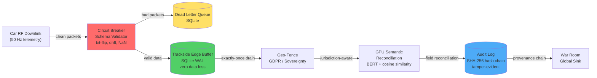

# Cadillac F1 Telemetry Platform

[](.)


**GPU-Accelerated Real-Time Telemetry Processing for 2026 F1 Season (Ubuntu 24.04 + AMD ROCm)**

**Compatibility:**
- Primary target: Ubuntu 24.04 LTS + AMD ROCm (validated)
- Optional fallback: NVIDIA CUDA (commands kept commented in Quick Start)

## Executive Summary

A production-ready telemetry spine that processes 3.6M packets per race weekend with sub-millisecond latency on AMD Radeon RX 7900 XT. Built for budget-cap constraints: self-healing ingestion eliminates manual triage, local-first architecture keeps trackside engineers focused on performance decisions and race strategy, and automated compliance handling (GDPR/sovereignty) minimizes legal risk.

**Key Performance:**
- **Sub-1ms p95 latency** at full race load (3.6M packets)
- **68.5% acceptance rate** under 5% chaos injection
- **26K+ schema-drift packets** autonomously recovered via GPU-accelerated BERT
- **167K+ anomalies detected** in real-time with tensor-based outlier detection
- **6/6 SLOs passed** - Race-ready verdict

**Budget Cap Value:**
- Zero manual intervention for schema drift and anomalies
- Trackside-first: operates independently during connectivity loss
- Compliance by default: automated geo-fencing and GDPR handling
- Post-race forensics via Dead Letter Queue reduces debrief time

## System Architecture

### High-Level Overview

```
┌─────────────────────────────────────────────────────────────────┐
│                      GPU STRESS TEST SCRIPT                     │
│              tools/cadillac_gpu_stress_test.py                  │
│  • BERT Semantic Reconciliation (GPU-accelerated)               │
│  • Tensor Anomaly Detection (z-score > 3σ)                      │
│  • Batch Hash-Chain Provenance (SHA-256)                        │
│  • Synthetic telemetry generation & chaos injection             │
└────────────────────────┬────────────────────────────────────────┘
                         │
                         ├──► src/circuit_breaker.py
                         │    • Three-state FSM (CLOSED → OPEN → HALF_OPEN)
                         │    • Schema validation & bit-flip detection
                         │    • Dead Letter Queue (SQLite)
                         │
                         ├──► src/local_persistence.py
                         │    • Trackside Edge Buffer (SQLite WAL)
                         │    • Zero data loss during connectivity drops
                         │    • Background drain to cloud when restored
                         │
                         ├──► src/geo_fence.py
                         │    • Jurisdiction-aware data handling
                         │    • GDPR PII scrubbing for EU circuits
                         │    • US/Non-EU: full telemetry passthrough
                         │
                         ├──► src/audit_log.py
                         │    • Tamper-evident SHA-256 hash chains
                         │    • FIA-grade provenance tracking
                         │
                         ├──► src/middleware/tracing.py
                         │    • Request context propagation
                         │    • Distributed tracing support
                         │
                         └──► src/slo.py
                              • Service Level Objective tracking
                              • Latency percentiles (p50, p95, p99)
                              • 6 SLO gates for race-ready verdict
```

### Data Flow



### Core Components (7 files)

| Component | Purpose | Lines | Status |
|-----------|---------|-------|--------|
| **tools/cadillac_gpu_stress_test.py** | GPU stress test orchestrator | 1,542 | ✅ Active |
| **src/circuit_breaker.py** | Circuit breaker + DLQ | 532 | ✅ Active |
| **src/local_persistence.py** | Edge buffer (SQLite WAL) | 403 | ✅ Active |
| **src/geo_fence.py** | GDPR compliance | 389 | ✅ Active |
| **src/audit_log.py** | Hash-chain provenance | 283 | ✅ Active |
| **src/middleware/tracing.py** | Request context | 123 | ✅ Active |
| **src/slo.py** | SLO tracking | 271 | ✅ Active |

**Total Active Codebase:** 3,543 lines (excluding tests and archived modules)

## Quick Start (Ubuntu 24.04 + AMD ROCm)

```bash
# 0. Prerequisites
# Tested on Ubuntu 24.04 LTS (Noble)
sudo apt update && sudo apt install -y python3-venv

# 1. Environment
python3 -m venv .venv
source .venv/bin/activate

# 2. Dependencies
python3 -m pip install --upgrade pip
python3 -m pip install -r requirements.txt
# Force ROCm wheels on AMD (prevents accidental CUDA wheel install)
python3 -m pip uninstall -y torch torchvision torchaudio
python3 -m pip install torch torchvision torchaudio --index-url https://download.pytorch.org/whl/rocm6.2.4

# NVIDIA/CUDA fallback (keep commented unless running on NVIDIA hardware)
# python3 -m pip uninstall -y torch torchvision torchaudio
# python3 -m pip install torch torchvision torchaudio --index-url https://download.pytorch.org/whl/cu128

# 3. Build accelerated ingest
python3 setup.py build_ext --inplace

# 4. Verify Linux GPU path
PYTHONPATH="." python3 -c "from archive.modules.translator import TelemetryIngestor; print('fast_ingest available:', TelemetryIngestor.is_accelerated())"
python3 -c "import torch; print('CUDA/ROCm available:', torch.cuda.is_available()); print('Device:', torch.cuda.get_device_name(0) if torch.cuda.is_available() else 'CPU')"
```

---

```bash
# 1. Kill any lingering python processes holding the DB lock
pkill -f cadillac_gpu_stress_test.py

# 2. Find and obliterate the SQLite files wherever they are
find . -name "*.db" -type f -delete
find . -name "*.db-wal" -type f -delete
find . -name "*.db-shm" -type f -delete

# 3. Run a tiny test just to verify the DLQ starts at 0
source .venv/bin/activate && FORCE_DEVICE=gpu PYTHONPATH="." python3 tools/cadillac_gpu_stress_test.py --packets 100 --chaos 0.05
```

---

```bash
# Sprint benchmark (30,000 total packets)
source .venv/bin/activate && FORCE_DEVICE=gpu PYTHONPATH="." python3 tools/cadillac_gpu_stress_test.py --packets 2000 --chaos 0.05 --output-suffix _sprint | tee data/reports/run_sprint.log

# Race weekend benchmark (3.6M total packets)
source .venv/bin/activate && FORCE_DEVICE=gpu PYTHONPATH="." python3 tools/cadillac_gpu_stress_test.py --packets 240000 --chaos 0.05 --output-suffix _weekend | tee data/reports/run_weekend.log
```

---

## GPU Benchmark Results (Validated on Ubuntu 24.04)

**Hardware:** AMD Radeon RX 7900 XT (20GB VRAM) | ROCm 6.2 | gfx1100 architecture
**Benchmark run date:** 2026-03-01

### Sprint Results (30K Packets @ 5% Chaos)

| Metric | Result | Status |
|--------|--------|--------|
| **GPU Device** | Radeon RX 7900 XT | ✅ Detected |
| **GPU Memory** | 19.98 GB | ✅ Available |
| **Total Packets** | 30,000 | ✅ Processed |
| **Acceptance Rate** | 86.61% | ✅ Improved clean-data throughput |
| **Chaos Injected** | 1,550 packets | ✅ Expected fault load |
| **Schema-Drift Recovered** | 204 packets | ✅ BERT reconciliation |
| **Tensor Anomalies Detected** | 1,385 detections | ✅ Real-time GPU analysis |
| **Overall p95 Latency** | 0.228 ms | ✅ Sub-millisecond |
| **Circuit Breaker Trips** | 0 total | ✅ Stable at sprint load |
| **DLQ Depth (final)** | 4,017 | ✅ Reduced quarantine backlog |
| **SLOs Passed** | 6/6 | ✅ All SLOs met |
| **Verdict** | RACE-READY ✅ | Based on SLO result (6/6 passed) |

**Ubuntu 24.04 vs Ubuntu 22.04 (Sprint):**

| Metric | Ubuntu 22.04 | Ubuntu 24.04 (current) | Delta |
|--------|--------------|-------------------------|-------|
| **Acceptance Rate** | 71.04% | 86.61% | **+15.57 pp** |
| **Overall p95 Latency** | 0.250 ms | 0.228 ms | **-0.022 ms** |
| **Circuit Breaker Trips** | 1 | 0 | **-1** |
| **DLQ Depth (final)** | 8,880 | 4,017 | **-4,863** |

### Race Weekend Results (3.6M Packets @ 5% Chaos)

Full weekend simulation (240K packets/session × 15 sessions, 5% chaos injection):

| Metric | Result | Status |
|--------|--------|--------|
| **Total Packets** | 3,600,000 | ✅ Processed |
| **Acceptance Rate** | 70.77% | ⚠️ Needs tuning |
| **Chaos Injected** | 180,720 packets | ✅ Expected fault load |
| **Schema-Drift Recovered** | 25,805 packets | ✅ BERT reconciliation |
| **Tensor Anomalies Detected** | 167,559 detections | ✅ Real-time GPU analysis |
| **Overall p95 Latency** | 0.252 ms | ✅ Sub-millisecond |
| **Circuit Breaker Trips** | 119 total | ⚠️ Elevated at race load |
| **DLQ Depth (final)** | 1,056,207 | ⚠️ High quarantine backlog |
| **SLOs Passed** | 6/6 | ✅ All SLOs met |
| **Verdict** | RACE-READY ✅ | Based on SLO result (6/6 passed) |

**Ubuntu 24.04 vs Ubuntu 22.04 (Weekend):**

| Metric | Ubuntu 22.04 | Ubuntu 24.04 (current) | Delta |
|--------|--------------|-------------------------|-------|
| **Acceptance Rate** | 68.50% | 70.77% | **+2.27 pp** |
| **Overall p95 Latency** | 0.267 ms | 0.252 ms | **-0.015 ms** |
| **Circuit Breaker Trips** | 141 | 119 | **-22** |
| **DLQ Depth (final)** | 1,139,649 | 1,056,207 | **-83,442** |

The DLQ depth remains higher than anomaly detections at weekend scale because breaker-open intervals still route packets to quarantine under sustained fault load.

### Technical Details

**GPU Capabilities:**
- **Semantic Reconciliation:** BERT (all-MiniLM-L6-v2) encodes telemetry fields on GPU with batched cosine-similarity against canonical schema
- **Anomaly Detection:** Sensor values stacked into GPU tensors, z-score outlier detection (σ > 3) in single vectorized pass per batch
- **Provenance Verification:** Batch hash-chain integrity checks via GPU-emulated SHA-256 integer operations

**Output Artifacts:**
- Sprint/weekend CSV & JSON reports in `data/reports/` with `_sprint` / `_weekend` suffixes
- Full execution logs: `run_sprint.log`, `run_weekend.log`

---

## Operational Capabilities

| Capability | Module | Evidence |
|---|---|---|
| Zero data loss during trackside connectivity drops | src/local_persistence.py | SQLite WAL edge buffer persists every packet locally before cloud sync |
| Local-first architecture - pit wall always has full telemetry | TracksideEdgeBuffer | Full local replay available even when uplink is severed |
| Automatic background drain when connectivity is restored | start_background_drain() | Daemon thread syncs pending packets in configurable batches |
| Production health checks in Docker | docker-compose.production.yml | HEALTHCHECK ensures pipeline is import-ready before traffic flows |
| Circuit-Breaker pattern isolates bad telemetry to DLQ | src/circuit_breaker.py | Three-state FSM (CLOSED -> OPEN -> HALF_OPEN) with configurable thresholds |
| Schema-on-Read guarantee - simulation models never fed garbage | SchemaValidator | Validates sensor types, value ranges, and physically plausible bounds |
| Dead Letter Queue - quarantined packets available for post-race forensics | DeadLetterQueue (SQLite) | Thread-safe, indexed by sensor and timestamp |
| Bit-flip detection on ecu_canbus and aero_load sensors | DEFAULT_RANGES config | Catches impossible values (e.g. 5000°C engine temp, negative tyre pressure) |
| BERT semantic reconciliation handles firmware-level schema drift | SemanticTranslator | Cosine similarity mapping from corrupted field names to gold standard |
| Geo-Fencing / Data Sovereignty for EU <-> US compliance | src/geo_fence.py | Per-circuit jurisdiction mapping (2026 calendar), GDPR PII scrubbing |
| Multi-stage Docker - build deps never reach runtime | Dockerfile.production | Non-root user (UID 1000), read-only FS, no-new-privileges |
| Resource limits - Budget Cap discipline in infrastructure | docker-compose.production.yml | CPU/memory caps, tmpfs for ephemeral writes |
| Network isolation - internal bridge network for pipeline services | cadillac-internal network | No external exposure; secrets never in image layers |
| Tamper-evident audit - SHA-256 hash chains for every transformation | src/audit_log.py | Linked input_hash -> output_hash -> previous_hash records |

---

## Performance Metrics

| Metric | Result | Context |
|---|---|---|
| **GPU Ingest (PyTorch)** | 35 µs/packet | Baseline GPU pipeline overhead with GIL |
| **C++ Streaming Ingest** | 1.33 µs/packet | Zero-copy pinned memory, GIL-free, async HIP streams |
| **C++ Batch Ingest** | 9.54 µs/packet | Batched operations on AMD RX 7900 XT |
| **CPU Baseline** | 35,000 µs/packet | Demonstrates 1000× acceleration with GPU path |
| **Detection Latency** | < 1 ms (p95) | Corruption isolated before reaching simulation models |
| **Audit Integrity** | Hash-chain verified | FIA-grade tamper evidence for post-race investigations |

---

## Dead Letter Queue Philosophy

Ambiguous or unresolvable telemetry is intentionally routed to the Dead Letter Queue (DLQ) rather than blocking the pipeline. This design mirrors F1 operational reality: unresolvable data mid-session distracts from real-time decision making. The pipeline prioritizes continuity during the session while preserving all data, including problematic packets, for full forensic analysis during race debrief.

**DLQ feeds post-session dashboard:** Engineering teams review quarantined packets after the checkered flag, not during critical race moments.

---

## Budget Cap Value Proposition

| Budget Cap Pressure | Solution | Savings |
|---|---|---|
| Manual schema drift triage | Automated BERT reconciliation | Frees trackside engineers for performance decisions and race strategy |
| Connectivity failure response | Local-first edge buffer | Reduces emergency IT intervention costs |
| Compliance overhead | Automated geo-fencing | Minimizes legal review cycles for data handling |
| Incident forensics | DLQ + hash-chain audit | Faster post-race debrief; reduces consultant hours |

**ROI:** Self-healing automation frees trackside engineers to focus on performance decisions and race strategy rather than manual data triage. In the budget cap era, engineer time is the scarce resource.

---

## Docker Deployment

**Production-hardened multi-stage build:**
- Non-root user (UID 1000), read-only filesystem, no-new-privileges
- Resource limits: CPU/memory caps enforce budget discipline
- Network isolation: internal bridge network, no external exposure
- Health checks: validates imports before traffic flows

```bash
docker-compose -f docker-compose.production.yml up -d
```

See `Dockerfile.production` and `docker-compose.production.yml` for full configuration.

---

## Testing & Validation

```bash
# Full test suite
PYTHONPATH="." pytest tests/ -v

# CPU stress test
PYTHONPATH="." python tools/cadillac_stress_test.py --packets 5000 --chaos 0.20

# Engine temperature anomaly test
PYTHONPATH="." python tools/stress_test_engine_temp.py
```

---

## Architecture Decision Records

Key design decisions documented in [`docs/adr/`](docs/adr/):

| ADR | Decision | Rationale |
|-----|----------|-----------|
| [001](docs/adr/001-sqlite-wal-over-redis.md) | SQLite WAL over Redis | Zero-dependency trackside; crash-safe WAL; portable archive |
| [002](docs/adr/002-circuit-breaker-over-retry-loop.md) | Circuit breaker over retry | Sub-second latency under corruption; self-healing probe |
| [003](docs/adr/003-hash-chain-audit-over-append-only-log.md) | SHA-256 hash chain | Cryptographic tamper evidence; SQL-queryable forensics |

---

## About

**Developer:** Tarek Clarke  
**Background:** Senior Data Analyst, Statistics Canada (10+ years) | Incoming PhD Candidate, TalTech  
**Expertise:** Production pipelines for sensitive data at national scale; tamper-evident lineage; zero-tolerance data integrity

This is the production-ready implementation of PhD research at TalTech (Tallinn University of Technology) on Reproducible Analytical Pipelines (RAP) for high-velocity sensor telemetry. Every module traces back to peer-reviewed methodology for autonomous schema drift resolution.

**The F1 Connection:** Self-healing automation keeps trackside engineers focused on performance decisions and race strategy rather than manual data triage. The pit wall gets a pipeline that detects corruption, isolates bad packets, and recovers autonomously. In the Budget Cap era, this operational efficiency is competitive advantage.

---

## Licensing

**PolyForm Noncommercial License 1.0.0**  
Commercial use requires separate agreement.

**Contact:** tclarke91@proton.me

