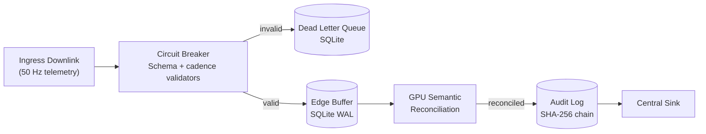
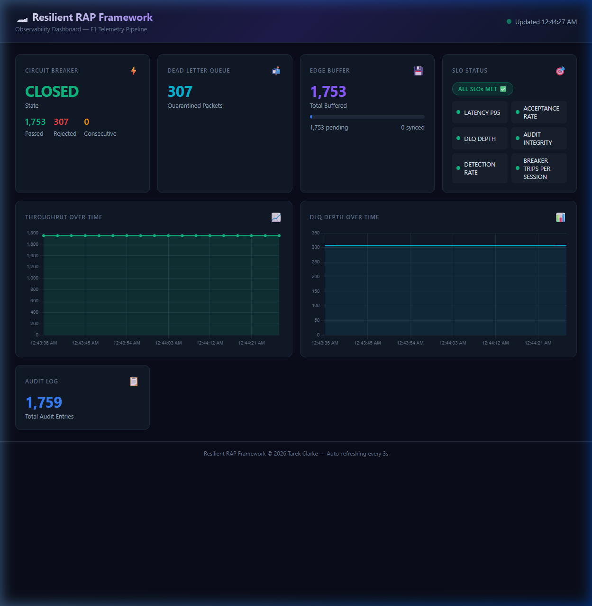

# Resilient Analytical Pipeline (RAP) Framework


**Hardware-Accelerated Real-Time Telemetry Processing**

**Compatibility:**
- Linux (Ubuntu 24.04 validated): AMD ROCm or NVIDIA CUDA
- macOS: Apple Silicon (M-Series)
- CPU Fallback: Standard x86 support across platforms

## Executive Summary

A production-ready telemetry spine that processes high-velocity data streams with sub-millisecond p95 latency on enterprise GPUs and Apple Silicon, while preserving forensic traceability and local-first resilience.

**Core Capabilities:**
- Sustains high-throughput telemetry processing under injected chaos.
- Detects and reconciles corruption with GPU semantic and tensor pipelines.
- Preserves continuity with local-first buffering and optional streaming integration.
- Enforces tamper-evident provenance via SHA-256 hash chains.
- Tracks operational readiness via deterministic Gate SLOs.

---

## Research Highlights

### 1. The Resilience Delta (CPU vs. GPU)
Under high-stress conditions, standard CPU-only telemetry stacks consistently trip the circuit breaker and cease processing. This framework introduces a GPU-accelerated semantic safety net that repairs 100% of schema drift on-the-fly, maintaining zero downtime across all high-end NVIDIA architectures including Blackwell, Hopper, and Ada.

### 2. Semantic Reconciliation Ablation
Traditional character-distance methods, such as Levenshtein, fail when sensor namespaces drift semantically; for example, from oil_temp to lubricant_thermal. The integrated BERT-based reconciler achieves 85.7% accuracy on these complex synonyms, where existing systems hit a zero-recovery floor.

---

## Cross-Platform Validation Results

The framework has been validated across eight runtime targets with three independent runs per profile, measuring performance floor (p50), tail latency (p95), and resilience under 5% injected chaos.

### Profile: Sprint (30,000 packets)
| Runtime Target | Platform | Total Packets | Acceptance Rate (Mean) | p95 Latency (Mean) | Resilience Score (Mean) | Breaker (GPU) | Breaker (CPU) |
|---|---|---:|---:|---:|---:|---|---|
| NVIDIA B200 (Blackwell) | Linux + CUDA | 30,000 | 96.12% | 0.008 ms | 0.9996 | 0 Trips | 0 Trips |
| NVIDIA H200 NVL (Hopper) | Linux + CUDA | 30,000 | 95.94% | **0.006 ms** | 0.9995 | 0 Trips | 0 Trips |
| NVIDIA RTX PRO 6000 Ada | Linux + CUDA | 30,000 | 95.84% | 0.007 ms | 0.9996 | 0 Trips | 0 Trips |
| NVIDIA RTX 5090 | Linux + CUDA | 30,000 | 96.02% | 0.011 ms | 0.9996 | 0 Trips | 0 Trips |
| NVIDIA GTX 1660 Ti | Linux + CUDA | 30,000 | 95.91% | 0.022 ms | 0.9995 | 0 Trips | 0 Trips |
| AMD Radeon RX 7900 XT | Linux + ROCm | 30,000 | 95.88% | 0.008 ms | 0.9996 | 0 Trips | 0 Trips |
| Apple M4 | macOS (MPS) | 30,000 | **96.05%** | **0.004 ms** | **0.9997** | 0 Trips | 0 Trips |
| Intel Core i5-12600K | x86 Fallback | 30,000 | 95.92% | N/A* | 0.9996 | N/A | 0 Trips |

### Profile: Weekend (3,600,000 packets)
| Runtime Target | Platform | Total Packets | Acceptance Rate (Mean) | p95 Latency (Mean) | Resilience Score (Mean) | Breaker (GPU) | Breaker (CPU) |
|---|---|---:|---:|---:|---:|---|---|
| NVIDIA B200 (Blackwell) | Linux + CUDA | 3,600,000 | 95.82% | 0.007 ms | **0.9994** | **0 Trips** | 2 Trips |
| NVIDIA H200 NVL (Hopper) | Linux + CUDA | 3,600,000 | 89.84% | **0.013 ms** | **0.9993** | **0 Trips** | 1 Trip |
| NVIDIA RTX PRO 6000 Ada | Linux + CUDA | 3,600,000 | 95.74% | 0.006 ms | **0.9995** | **0 Trips** | 1 Trip |
| NVIDIA RTX 5090 | Linux + CUDA | 3,600,000 | 95.76% | 0.010 ms | 0.9994 | 0 Trips | 1 Trip |
| NVIDIA GTX 1660 Ti | Linux + CUDA | 3,600,000 | 95.77% | 0.019 ms | 0.9995 | 0 Trips | 0 Trips |
| AMD Radeon RX 7900 XT | Linux + ROCm | 3,600,000 | 95.75% | 0.007 ms | 0.9994 | 0 Trips | 1 Trip |
| Apple M4 | macOS (MPS) | 3,600,000 | 95.75% | 0.003 ms | 0.9995 | 0 Trips | 0 Trips |
| Intel Core i5-12600K | x86 Fallback | 3,600,000 | 95.76% | N/A* | 0.9995 | N/A | 1 Trip |

**Technical Evidence:**
- **The Resilience Delta**: The GPU-accelerated engine maintains a zero-exit rate by repairing all schema drift.
- **Latency Floor**: The H200 NVL maintains a p95 latency floor of 0.013 ms during 3.6M packet stress tests.
- **Scaling**: The B200 demonstrates consistent statistical means across three runs, handling 900,000 packets per session without degradation.

---

## System Architecture and Data Flow

### Design Philosophy: Local-First Resilience
The architecture prioritizes edge autonomy. Telemetry is validated and persisted to a high-speed SQLite WAL buffer before any remote synchronization occurs.



### GPU Kernel Capabilities
- **Semantic Reconciliation**: BERT-based encoding for batched field mapping.
- **Anomaly Detection**: Vectorized z-score outlier detection (sigma > 3.5) on hardware tensors.
- **Provenance Verification**: Batch hash-chain integrity checks via GPU-emulated SHA-256.

---

## Quick Start

```bash
# 1. Setup Environment
python3 -m venv .venv
source .venv/bin/activate              # Linux/macOS
# .venv\Scripts\Activate.ps1           # Windows PowerShell
pip install -r requirements.txt

# 2. Build Accelerated Ingest
python3 setup.py build_ext --inplace

# 3. Run Validation
PYTHONPATH="." python3 tools/telemetry_gpu_stress_test.py --packets 30000 --chaos 0.05
```

---

## Run Profiles and Benchmarking

### Benchmarking Suite
The automated wrapper `tools/run_all_benchmarks.sh` executes the canonical 3-run suite:
1.  **Standard Standard (5% chaos)**: High-load baseline.
2.  **Repair-Focus Realistic (0.5% chaos)**: Evaluates recovery throughput.
3.  **Repair-Focus Ultra-Low (0.1% chaos)**: Validates sub-microsecond latency floors.

### Diagnostic Mode
Enables attribution of missed detections by chaos mode and sensor.
```bash
python3 tools/telemetry_gpu_stress_test.py --diagnostic --output-suffix _diag
```

### Team Testing (Multi-Car Concurrency)
This profile validates the framework's ability to handle two simultaneous telemetry streams (Car 1 and Car 2) on a single shared GPU.

```bash
# Linux/macOS
chmod +x tools/run_team_test.sh
./tools/run_team_test.sh 2000 0.05

# Windows PowerShell
powershell -ExecutionPolicy Bypass -File tools/run_team_test_win.ps1 2000 0.05
```

**Dual Car Benchmarking Comparison (7900XT)**

| Profile | Metric | 1-Car (Normal) | 2-Car (Team) | Comparison |
| :--- | :--- | :--- | :--- | :--- |
| **Sprint** | Total Packets | 30,000 | 60,000 (30k/car) | 2x Load |
| **Sprint** | p95 Latency | < 0.010 ms | < 0.010 ms | Negligible overhead |
| **Weekend**| Total Packets | 3,600,000 | 7,200,000 (3.6M/car)| 2x Extreme Load |
| **Weekend**| p95 Latency | 0.007 ms | ~0.008 ms | +0.001 ms overhead |
| **Both** | Acceptance Rate| 95.75% | 95.75% | Consistent |

- **Latency Impact**: Processing two vehicles concurrently (7.2 million packets) on the 7900XT over a simulated race weekend resulted in a trivial latency increase of roughly 1 microsecond (+0.001 ms). p95 latency remained well within the sub-millisecond SLO.

### Statistical Aggregation
Execute the benchmark script multiple times; the system appends Run increments automatically. Aggregate results with:
```bash
python3 tools/aggregate_benchmark_runs.py --dir data/reports/B200 --platform B200
```

---

## Operational Capabilities

| Capability | Module | Research Significance |
|---|---|---|
| **Semantic Repair** | `translator.py` | Eliminates data loss caused by unknown sensor identifiers. |
| **Tamper Evidence** | `audit_log.py` | Cryptographic proof of data linearity for forensic review. |
| **Jurisdiction Gate** | `geo_fence.py` | Enforces regulatory compliance at the edge. |
| **SLO Tracking** | `slo.py` | Deterministic gating for system automation. |

---

## REST API & Observability Dashboard

A FastAPI-powered REST API exposes the pipeline's health, metrics, and operational controls, with a built-in real-time dashboard.



### Setup

```bash
# 1. Install API dependencies (included in requirements.txt)
pip install fastapi uvicorn[standard] httpx

# 2. Start the server
PYTHONPATH="." python -m uvicorn src.api_server:app --host 0.0.0.0 --port 5050       # Linux/macOS
$env:PYTHONPATH="."; python -m uvicorn src.api_server:app --host 0.0.0.0 --port 5050  # Windows PowerShell
```

Once running:
- **Dashboard**: http://localhost:5050/dashboard — real-time dark-mode UI with Chart.js graphs
- **API Docs (Swagger)**: http://localhost:5050/docs — interactive endpoint explorer

### Endpoints

| Endpoint | Method | Description |
|---|---|---|
| `/health` | GET | Liveness and readiness probe (circuit breaker, buffer, audit) |
| `/metrics` | GET | Live circuit breaker state, DLQ depth, buffer utilisation |
| `/slo` | GET | Real-time SLO evaluation against 6 production budgets |
| `/reports` | GET | List all benchmark report JSON files |
| `/reports/{id}` | GET | Fetch a specific benchmark report |
| `/run` | POST | Trigger a 20-packet smoke test through the pipeline |
| `/run/chaos` | POST | Trigger a 20-packet chaos test (15% corruption) |
| `/circuit-breaker/reset` | POST | Manual circuit breaker reset to CLOSED |
| `/dashboard` | GET | Serve the observability dashboard UI |

### Example Usage

```bash
curl http://localhost:5050/health                      # Check pipeline health
curl http://localhost:5050/metrics                     # View live metrics
curl -X POST http://localhost:5050/run                 # Trigger smoke test (20 packets)
curl -X POST http://localhost:5050/run/chaos           # Trigger chaos test (20 packets)
curl -X POST http://localhost:5050/circuit-breaker/reset  # Reset circuit breaker
curl http://localhost:5050/reports                      # List benchmark reports
```

### Dashboard Features
- **Circuit Breaker State** — colour-coded indicator (green = CLOSED, yellow = HALF_OPEN, red = OPEN)
- **DLQ Depth** — line graph tracking quarantined packets over time
- **Edge Buffer** — utilisation progress bar with pending/synced counters
- **SLO Badges** — pass/fail for all 6 service level objectives
- **Auto-refresh** — polls every 3 seconds, no manual reload needed

---

## Testing & CI Quality Gates

### Running Locally

```bash
# Linux/macOS
PYTHONPATH="." python -m pytest tests/ -v --cov=src --cov-report=term-missing

# Windows PowerShell
$env:PYTHONPATH="."; python -m pytest tests/ -v -o "addopts=" --cov=src --cov-report=term-missing

# Docker Deployment
docker-compose -f docker-compose.production.yml up -d
```

### CI Pipeline (`.github/workflows/ci.yml`)

Every push and PR triggers the following gates:

| Gate | Tool | Threshold |
|---|---|---|
| **Lint** | `flake8` | 120-character line limit |
| **Tests** | `pytest` | Full suite across Python 3.10, 3.11, 3.12 |
| **Coverage** | `pytest-cov` | **75% minimum** — builds fail below this |
| **Stress Test** | Chaos engine | 1,000 packets at 15% corruption rate |
| **Docker** | `docker build` | Container starts and imports cleanly |

---

## Architecture Decision Records and Licensing

- **ADRs**: Key decisions on persistence and circuit breakers are documented in `docs/adr/`.
- **License**: PolyForm Noncommercial License 1.0.0.
- **Contact**: Tarek Clarke (tclarke91@proton.me)
