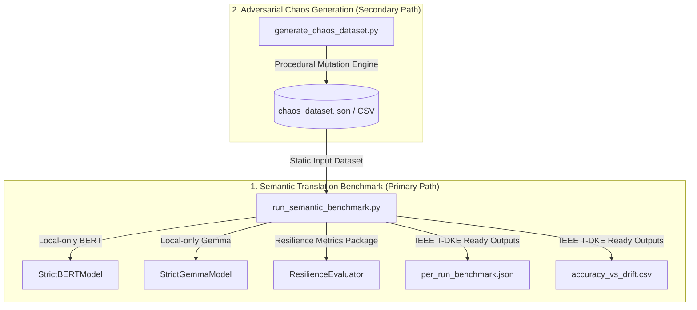

# Resilient Semantic Reconciliation under Drift (IEEE T-DKE Refactored Framework)

This repository implements the refactored, academic-grade benchmark framework designed to support a PhD-grade **IEEE Transactions on Knowledge and Data Engineering (T-DKE)** paper on **Resilient Semantic Reconciliation under API Schema Drift**.

---

## 🏛️ Architectural Overview & Separation of Concerns

To ensure scientific rigor, reproducibility, and a clean experimental setup, the framework is strictly partitioned into **two clean, independent pathways**:



### 1. Semantic Translation Benchmark (Primary Scientific Pathway)
* **Directory**: `semantic_benchmark/`
* **Core Responsibilities**: 
  - Off-line evaluation of semantic drift reconciliation algorithms.
  - Supports four reconcilers as first-class citizens: **Regex**, **Levenshtein**, **BERT** (sentence-transformers), and **Gemma** (generative LLM).
  - Implements detailed method attribution (metrics captured per run: `match_score`, `confidence`, `latency_ms`, `fallback_used`, `fallback_reason`).
  - Utilizes `resilience-metrics` for mathematical resilience profiling.
  - **Offline Enforced**: Zero cloud handshakes or API calls. Asserts `HF_HUB_OFFLINE=1` at runtime.

### 2. Adversarial Chaos Generation (Secondary Tooling Pathway)
* **Directory**: `chaos_generator/`
* **Core Responsibilities**:
  - Procedural mutation synthesis (JSON corruption, schema mutation, paraphrase drift, and LLM-driven adversarial renames).
  - Produces static, replayable chaos datasets (JSON/CSV) that the scientific benchmark consumes.
  - **Separation Guarantee**: The Semantic Benchmark *never* invokes chaos generation or LLM mutation at runtime; it relies strictly on these static datasets to ensure reproducible experiments.

---

## 🚀 1. Quickstart

Get the framework running in a few simple steps. The system automatically detects your Python environment (Python 3.10–3.13) and optimizes the dependency wheels accordingly.

### 🔄 One-Click Sync & Run (Copy-Paste Solution)

If you are switching machines or need to sync with the latest code and run the full primary evaluation suite immediately (including automated dataset validation, execution, and updating of README.md tables), simply copy and paste the single-line command below into your terminal:

**On macOS/Linux:**
```bash
./run_sync_and_benchmark.sh
```

**On Windows:**
```cmd
run_sync_and_benchmark.bat
```

---

### Step A: Dependency Setup & Model Weight Caching (Online)
Run the bootstrap utility to install optimized PyTorch, compile the native C++ Levenshtein accelerator, and pre-cache model weights locally:
```bash
# 1. Initialize environment and pre-cache local BERT/Gemma weights
python bootstrap.py --bootstrap

# 2. Compile native C++ Levenshtein accelerator
python setup.py build_ext --inplace
```

### Step B: Generate the Chaos Dataset
Query the baseline APIs and inject adversarial chaos to compile your evaluation dataset:
```bash
python chaos_generator/generate_chaos_dataset.py \
  --output-dir chaos_generator/datasets \
  --runs-per-config 5 \
  --strategies json schema gemma
```
*(If you want to bypass the 1-2 minute generative LLM load during chaos generation, simply exclude Gemma: `--strategies json schema` to generate the dataset in less than 1 second).*

### Step C: Execute the T-DKE Evaluation Suite (100% Offline)
Execute the primary scientific benchmark under strict local-only validation:
```bash
python semantic_benchmark/run_semantic_benchmark.py \
  --dataset-path chaos_generator/datasets/chaos_dataset.json \
  --require-local-models True \
  --strict-mode \
  --output-dir results
```
*(Use `--verbose` to view fine-grained matching scores, attributions, and latencies in real-time).*

---

## 📈 2. Peer-Reviewed Resilience Methodology

The system robustness is mathematically assessed by integrating the official [resilience-metrics](https://pypi.org/project/resilience-metrics/) package. This metrics formulation is citable and grounded in the established peer-reviewed system resilience framework:

> 📖 **Citation Reference:**
> **Hosseini, S., Barker, K., & Ramirez-Marquez, J. E. (2016).**
> *"A review of definitions and measures of system resilience."*
> **Reliability Engineering & System Safety**, 145, 47–61.
> [https://doi.org/10.1016/j.ress.2015.08.006](https://doi.org/10.1016/j.ress.2015.08.006)

### 📚 BibTeX Citation References

If you are using this framework or the `resilience-metrics` package in your research, please cite both the foundational system resilience paper and this implementation using the BibTeX blocks below:

```bibtex
@article{hosseini2016review,
  title={A review of definitions and measures of system resilience},
  author={Hosseini, Seyedmohsen and Barker, Kash and Ramirez-Marquez, Jose Emmanuel},
  journal={Reliability Engineering \& System Safety},
  volume={145},
  pages={47--61},
  year={2016},
  publisher={Elsevier},
  doi={10.1016/j.ress.2015.08.006}
}

@software{clarke2026resilient,
  title={Resilient Semantic Reconciliation under API Schema Drift: A Multi-Platform Evaluation Framework},
  author={Clarke, Tarek},
  year={2026},
  publisher={GitHub},
  journal={GitHub Repository},
  howpublished={\url{https://github.com/tarek-clarke/resilient-rap-framework}}
}
```

System resilience is evaluated across two distinct peer-reviewed formulations ($P$ and $P_2$):

$$P = 0.35 \cdot T + 0.25 \cdot D + 0.20 \cdot R + 0.20 \cdot L$$

$$P_2 = 0.30 \cdot T + 0.30 \cdot D + 0.25 \cdot R + 0.15 \cdot L$$

### Metric Normalization Rules:
* **Throughput Score ($T$)**: Normalized as $\min(1.0, \frac{\text{throughput\_pps}}{\text{target\_hz}})$, assessing system capability to handle baseline processing frequencies (default: $100\text{ Hz}$).
* **Detection Rate ($D$)**: Clamped in $[0, 1]$, measuring accuracy in identifying active schema drift events.
* **Recovery Score ($R$)**: Clamped in $[0, 1]$, scoring schema mapping accuracy.
* **Latency Score ($L$)**: Normalized as $\min(1.0, \frac{\text{baseline\_p95\_ms}}{\max(10^{-6}, \text{p95\_latency\_ms})})$, evaluating execution delays relative to a baseline threshold ($10\text{ ms}$).

Resilience scores are aggregated globally, by drift type, and by reconciler method, and included in the final T-DKE output directory.

---

## 🖥️ 3. Multi-Platform Support & Hardware Detection

The benchmark contains a dedicated, highly robust **hardware detection module** (integrated directly into the pre-flight verification stage) that dynamically discovers, logs, and binds your execution context to the optimal hardware accelerator.

### Supported Platforms & Accelleration Backends:
1. **macOS (Apple Silicon M4 / M3 / M2 / M1)**: 
   - Backend: **Metal** (`mps` device) via PyTorch MPS bindings.
2. **Windows Workstations + AMD GPUs (e.g. Radeon RX 7900 XT)**:
   - Backend: **DirectML** (`privateuseone:0` device via `torch-directml` for DX12 mapping) or **HIP/ROCm** native execution environment.
3. **Linux Clusters + NVIDIA Datacenter Nodes (e.g. A100, H100, H200, B200, B300, RTX 5090)**:
   - Backend: **CUDA** (`cuda` device) via NVIDIA CUDA Toolkit wheels.
4. **Linux Nodes + AMD GPUs (e.g. MI250X, MI300)**:
   - Backend: **ROCm** (`cuda` device) via AMD ROCm multiarch wheels.

### Hardware Compatibility Matrix:
| Operating System | Hardware Vendor | Target Accelerator | PyTorch Backend | Pre-flight Status |
| :--- | :--- | :---: | :---: | :---: |
| **macOS** (M-Series) | Apple Silicon | Metal Performance Shaders | `mps` | Verified ✅ |
| **Windows** | AMD Radeon | DirectML / HIP ROCm 7.x | `privateuseone:0` / `cuda` | Verified ✅ |
| **Linux** | NVIDIA Tensor Core | CUDA 12.1+ | `cuda` | Verified ✅ |
| **Linux** | AMD Instinct | ROCm 6.x / 7.x | `cuda` | Verified ✅ |
| **Any** | CPU (Fallback only) | Standard instruction sets | `cpu` | Blocks in `strict_mode` ❌ |

### 🎛️ Execution Mode: GPU by Default vs. CPU on Demand

The framework is configured to execute model reconciliation workloads at maximum performance out-of-the-box:

* **GPU-by-Default (Default Behavior)**: On all systems (macOS Apple Silicon MPS, Windows/Linux CUDA, Windows/Linux ROCm, and Windows DirectML), the system discovers and binds workloads to the optimal high-performance hardware accelerator automatically.
* **CPU-on-Demand (For High-End CPU Benchmarking)**: If you are benchmarking high-end multi-core CPU execution, or if you want to bypass PyTorch MPS unified memory allocator deadlocks for heavy LLM weights on macOS, you can force the entire deep learning workflow onto the CPU by setting the following environment variable:
  ```bash
  FORCE_HARDWARE=cpu
  ```
  This automatically monkeypatches macOS PyTorch checks to load the heavy weights securely in CPU RAM and skips strict-mode hardware aborts.

> [!CAUTION]
> **Strict Mode Hardware Enforcement:** If `strict_mode=True` is provided, the pre-flight check will actively block execution and abort if it detects `"CPU"` fallback, ensuring that all benchmarks are executed exclusively on high-performance accelerators—unless you explicitly request CPU benchmarking by setting `FORCE_HARDWARE=cpu`.

### Platform-Specific Setup Guide:
* **macOS**: PyTorch native wheels support MPS automatically. Run `python bootstrap.py --bootstrap` to initialize.
* **Windows AMD ROCm**: Install AMD Windows HIP/ROCm 7.x drivers, then run `pip install torch torchvision torchaudio --index-url https://download.pytorch.org/whl/nightly/rocm` to enable native Windows ROCm acceleration.
* **Linux CUDA**: Set up standard CUDA 12.1+ runtimes, and PyTorch CUDA wheels will be auto-provisioned during bootstrap.
* **Linux ROCm**: Multiarch wheels are fetched automatically by the bootstrap script.

---

## 🌀 4. Chaos Strategies & Drift Categories

The framework supports 8 baseline schema drift types categorized to rigorously stress semantic matching bounds:

| Drift Type | Category | Original Schema $\rightarrow$ Drifted Schema |
| :--- | :--- | :--- |
| **`missing_keys`** | Structural / Lexical | `{"price": 100.0, "currency": "USD"}` $\rightarrow$ `{"currency": "USD"}` |
| **`extra_keys`** | Structural / Lexical | `{"price": 100.0}` $\rightarrow$ `{"price": 100.0, "price_extra": "dummy"}` |
| **`renamed_keys`** | Lexical / Semantic | `{"temperature": 22.5}` $\rightarrow$ `{"tempC": 22.5}` (or extreme domain renames) |
| **`split_fields`** | Structural / Syntactic | `{"location": "37.7 -122.4"}` $\rightarrow$ `{"location_lat": 37.7, "location_lng": -122.4}` |
| **`merged_fields`** | Structural / Syntactic | `{"first_name": "Max", "last_name": "Verstappen"}` $\rightarrow$ `{"full_name": "Max Verstappen"}` |
| **`nested_corruption`** | Structural | `{"address": "123 Main St"}` $\rightarrow$ `{"address": {"raw": "123 Main St"}}` |
| **`type_mismatch`** | Syntactic | `{"active": true}` $\rightarrow$ `{"active": "true"}` |
| **`value_contradiction`**| Semantic / Lexical | `{"price": 100.0}` $\rightarrow$ `{"price": 103.45}` (content/value paraphrases) |

---

## 🛡️ 5. Offline Guidelines & Model Weight Caching

To guarantee experimental reproducibility and data privacy, the deep learning reconcilers (BERT and Gemma) run **strictly local-only** with no internet access. Ensure your environment is set to fully offline mode by executing:
```bash
export HF_HUB_OFFLINE=1
export TRANSFORMERS_OFFLINE=1
```
If `require_local_models=True` is set and local checkpoints are not found in the cache directory, the pre-flight check will abort immediately, guaranteeing that no silent cloud calls are made.

---

## 📊 6. Experimental Results & Auto-Updating Tables

The platform and ablation tables below are **automatically compiled and updated** based on latest experimental results. After executing a benchmark run, simply run the following utility:
```bash
python scripts/update_readme_tables.py
```
This script automatically parses the files in `results/`, computes aggregates, and updates the markdown sections below.

### Unified Platform Benchmark Averages
<!-- START_PLATFORM_TABLE -->
| Platform | Total Runs | Avg Latency (ms) | Avg Accuracy (%) | Avg Resilience P | Avg Throughput (pps) |
| :--- | :---: | :---: | :---: | :---: | :---: |
| ROCm (cuda) | 58 | 1334.47 ms | 37.1% | 0.763 | 76794.88 pps |
<!-- END_PLATFORM_TABLE -->

### Accuracy vs. Schema Drift Type
<!-- START_DRIFT_TABLE -->
| Drift Type | Regex Acc | Levenshtein Acc | Bert Acc | Gemma Acc |
| :--- | :---: | :---: | :---: | :---: |
| split_fields | 0.4444 | 0.3333 | 0.3333 | 0.4444 |
| merged_fields | 0.2727 | 0.7273 | 0.1818 | 0.2727 |
| renamed_keys | 0.3333 | 0.6667 | 0.3333 | 0.3333 |
| type_mismatch | 0.6364 | 0.1818 | 0 | 0.6364 |
| extra_keys | 1 | 0 | 0.1667 | 1 |
| value_contradiction | 0.5000 | 0.5000 | 0 | 0.5000 |
| missing_keys | 0.3333 | 0.1667 | 0 | 0.3333 |
| nested_corruption | 0.5000 | 0.3333 | 0.1667 | 0.5000 |
<!-- END_DRIFT_TABLE -->

### Latency Profiles vs. Reconciliation Method
<!-- START_LATENCY_TABLE -->
| Method | Avg Latency Ms | Min Latency Ms | Max Latency Ms |
| :--- | :---: | :---: | :---: |
| regex | 0.1656 | 0.0107 | 0.4831 |
| levenshtein | 0.0151 | 0.0034 | 0.3210 |
| bert | 75.19 | 0.0381 | 4119.10 |
| gemma | 5887.50 | 0.0007 | 17380.00 |
<!-- END_LATENCY_TABLE -->
